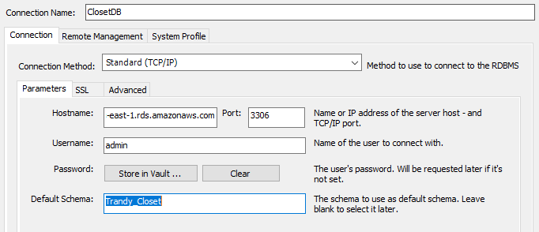
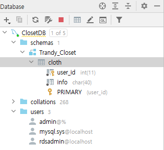

# 12/14

### Amazon RDS

- CPU, 메모리, 스토리지 및  IOPS 모두를 따로 분할하여 독립적으로 확장 가능
- 관리형 서비스 환경을 제공하기 위 해 Amazon RDS 는 DB인스턴스에 대해 shell 액세스를 제공하지 않음
- DB 엔진
  - MySQL
  - MariaDB
  - PostgreSQL
  - Oracle
  - Microsofy SQL server DB

### DB 인스턴스

- 기본 빌딩 블록인 DB 인스턴스는 AWS 클라우드에 있는 격리된 DB 환경임
- 독립 실행형 DB 인스턴스와 함께 사용하는 것과 동일한 도구 및 애플리케이션을 사용하여 엑세스 가능
- AWS CLS, Amazon RDS API 또는 AWS Management 콘솔을 사용해 DB 인스턴스 수정, 생성 가능

- DB 인스턴스 스토리지는 아래의 세가지 유형 제공
  - 마그네틱
  - 범용(SSD)
  -  프로비저닝된 IOPS(PIOPS)

- 충분한 스토리지를 보유하여 DB를 확장할 수 있는 여유를 확보하는 것이 중요

###  Amazon RDS DB 인스턴스 모니터링

- Amazon RDS 이벤트를 구독해 아래의 변경사항이 있을 경우 알림을 받을 수 있음
  - DB 인스턴스
  - DB 스냅샷
  - DB 파라미터 그룹 또는 DB 보안 그룹

### Amazon RDS 작업 방법

- **AWS Mangement 콘솔**
- 명령줄 인터페이스 (CLI)
- Amazon RDS를 사용한 프로그래밍

---

## Amzon Aurora

- MySQL 및 PostgreSQL 과 호환되는 완전 관리형 관계형 DB 엔진
- 속도와 안정성
- 기본 **스토리지**는 필요에 따라 **자동으로 커짐**
- DB 구성 및 관리의 가장 어려운 측면 중 하나인 DB 클러스터링 및 복제를 자동화 및 표준화 해줌
- 기존 애플리케이션을 거의 변경하지 않고도 MySQL 의 처리량의 최대 5배, PostgreSQL의 처리량의 최대 3배 제공

---

### DB 클러스터 생성 

1. ` https://console.aws.amazon.com/rds/` 에서 Amazon RDS 콘솔창에서 데이터베이스 생성
2. `Easy Create(간평생성)`-> 기본설정을 변경하고싶다면 `standard Create(표준생성)`
   => 액세스 설정을 위해 **starndard Create 후 퍼블릭 엑세서 허용!**
3. 검색엔진 `Aurora`
4. 에디션 `Amazon Aurora with MySQL compatibility`
5. DB 인스턴스 크기 `개발/테스트`
6. 마스터 이름 `admin` 과 암호 지정 ****
7. 데이터베이스 생성

### Aurora MySQL DB 클러스터의 DB 에 연결

1. MySQL WorkBench 창에서 Mangement Connections 선택 후 아래와 같이 작성

   

   

2. 연결이 안될 경우!! 
   - vpc 보안 그룹에 인바운드 규칙 check -> aurora port 포트포워딩 해줄 것!
   - 퍼블릭 액세스 가능성 check!
3. DB 연결 성공!

### DB 테이블 생성

- DataGrip 사용 (30days trial)

### #참고

- Amazon Aurora이란 무엇인가요?
  https://docs.aws.amazon.com/ko_kr/AmazonRDS/latest/AuroraUserGuide/CHAP_AuroraOverview.html

- DB 클러스터 생성 및 Aurora MySQL DB 클러스터의 데이터베이스에 연결
  https://docs.aws.amazon.com/ko_kr/AmazonRDS/latest/AuroraUserGuide/CHAP_GettingStartedAurora.CreatingConnecting.Aurora.html