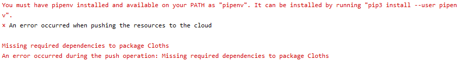

# #12/17

### Amplify API

- amplify update api

```shell
C:\Trandy-Closet\Cloud\S3Sample\S3TransferUtilitySample>amplify update api
? Please select from one of the below mentioned services: REST
? Please select the REST API you would want to update RESTfulapi
? What would you like to do Add another path
? Provide a path (e.g., /book/{isbn}): /Users
? Choose a Lambda source Create a new Lambda function
? Provide an AWS Lambda function name: post-Users
? Choose the runtime that you want to use: Python

```

- runtime - Python

```shell
? Do you want to configure advanced settings? Yes
? Do you want to access other resources in this project from your Lambda function? No
? Do you want to invoke this function on a recurring schedule? No
? Do you want to configure Lambda layers for this function? No
? Do you want to edit the local lambda function now? No
```

-  나머지 adventged settings 는 `N`입력

  

- 런타임이 python 일 경우 위와 같은 error code.....


- 런타임이 node.js 일 경우 정상적으로 잘 작동


### Amplify Lambda


- Amplify CLI, 여러 Lambda 함수에서 코드 및 자산을 손쉽게 공유할 수 있는 Lambda 계층에 대한 지원 추가https://aws.amazon.com/ko/about-aws/whats-new/2020/07/amplify-cli-adds-support-for-lambda-layers-to-easily-share-code-assets-across-lambda-functions/