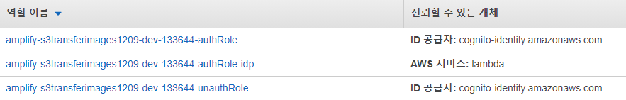
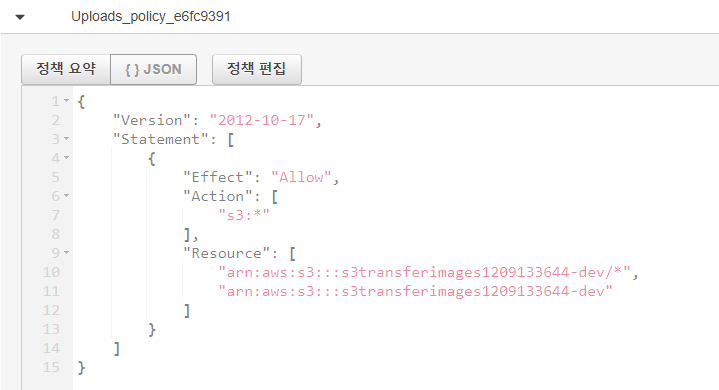

# [aws-sdk-android-samples](https://github.com/awslabs/aws-sdk-android-samples)/[S3TransferUtilitySample](https://github.com/awslabs/aws-sdk-android-samples/tree/main/S3TransferUtilitySample)/ **S3TransferUtilityTutorial.md**

[파일로 이동](https://github.com/awslabs/aws-sdk-android-samples/find/main)

<details id="blob-more-options-details" class="details-overlay details-reset position-relative" style="box-sizing: border-box; display: block; position: relative !important;"><summary role="button" type="button" class="btn " style="box-sizing: border-box; display: inline-block; cursor: pointer; position: relative; padding: 5px 16px; font-size: 14px; font-weight: 500; line-height: 20px; white-space: nowrap; vertical-align: middle; user-select: none; border-width: 1px; border-style: solid; border-color: var(--color-btn-border); border-image: initial; border-radius: 6px; appearance: none; color: var(--color-btn-text); background-color: var(--color-btn-bg); box-shadow: var(--color-btn-shadow),var(--color-btn-inset-shadow); transition: color 0.2s cubic-bezier(0.3, 0, 0.5, 1) 0s, background-color, border-color; list-style: none;"><svg aria-label="더 많은 옵션" class="octicon octicon-kebab-horizontal" height="16" viewBox="0 0 16 16" version="1.1" width="16" role="img"><path d="M8 9a1.5 1.5 0 100-3 1.5 1.5 0 000 3zM1.5 9a1.5 1.5 0 100-3 1.5 1.5 0 000 3zm13 0a1.5 1.5 0 100-3 1.5 1.5 0 000 3z"></path></svg></summary></details>

1. settings
   - Android API 레벨 16 (Android 4.1) 이상
2. `git clone https://github.com/awslabs/aws-sdk-android-samples`
3. 


### 에러코드


- app에서 이미지 업로드시 s3서비스에서 Access Denied 를받는다


- `Access Denied (Service: Amazon S3; Status Code: 403; Error Code: AccessDenied; Request ID: 28C8F7DCD58EE93F)`

https://aws.amazon.com/ko/premiumsupport/knowledge-center/s3-troubleshoot-403/


## 간략한 설명

Amazon S3에서 액세스 거부 오류를 해결하려면 다음을 확인합니다.

- 버킷 및 객체 소유권
- 버킷 정책 또는 AWS Identity and Access Management(IAM) 사용자 정책
- IAM 권한 경계
- Amazon S3 퍼블릭 액세스 차단 설정
- Amazon S3에 액세스하기 위한 자격 증명
- 임시 보안 자격 증명
- Amazon Virtual Private Cloud(Amazon VPC) 엔드포인트 정책
- Amazon S3 액세스 포인트 정책
- 누락된 객체
- AWS Key Management Service(AWS KMS) 암호화
- 버킷에 요청자 지불이 활성화됨
- AWS Organizations 서비스 제어 정책


- s3 bucket 정책 변환해보기

```
{
  "Id": "Policy1607493673053",
  "Version": "2012-10-17",
  "Statement": [
    {
      "Sid": "Stmt1607493649486",
      "Action": "s3:*",
      "Effect": "Allow",
      "Resource": "arn:aws:s3:::amplify-s3transferimages1209-dev-133644-deployment",
      "Principal": "*"
    }
  ]
}
```

### 문제해결

1. S3 Access Denied 의 이유는 cognito 연동 작업 시 인증 유무에 따라 role 이 바뀜!
2. 인증 절차 없을 경우 `unauthRole` 역할에 정책에 따라 진행
3. `unathRole`에 s3에 putObject 할수 있는 권한을 부여주면 됨!




  

