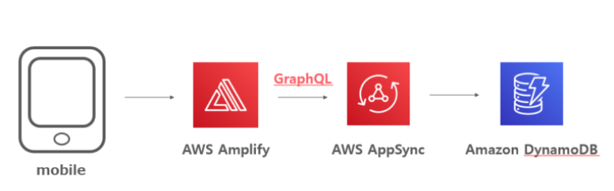
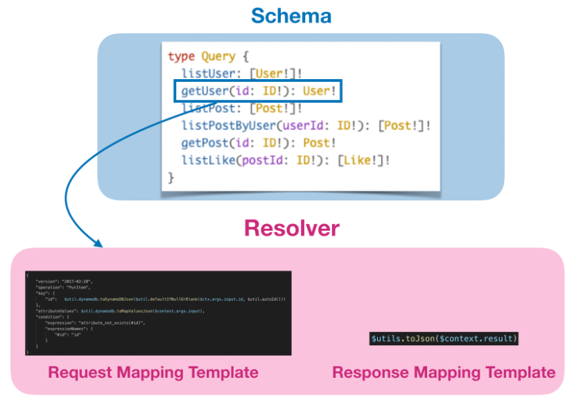
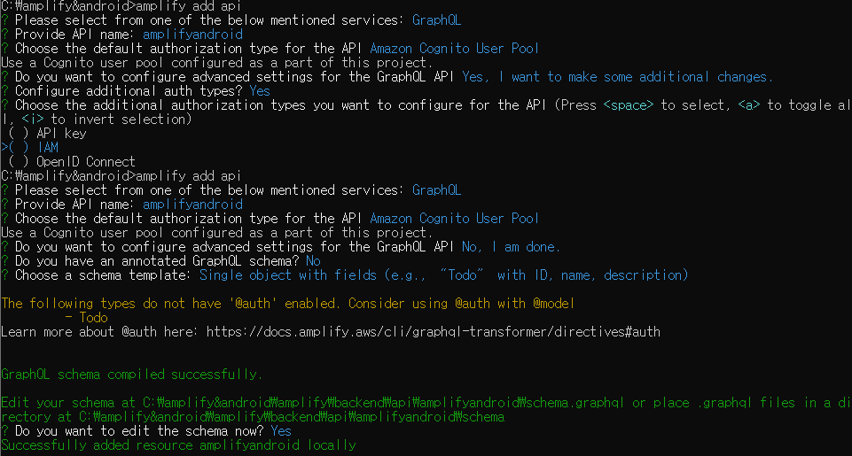
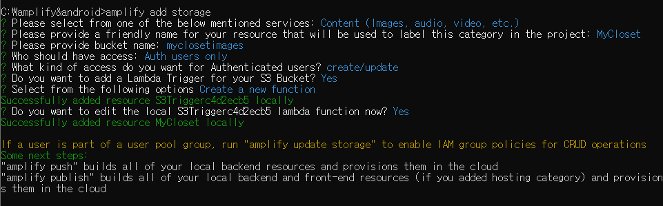
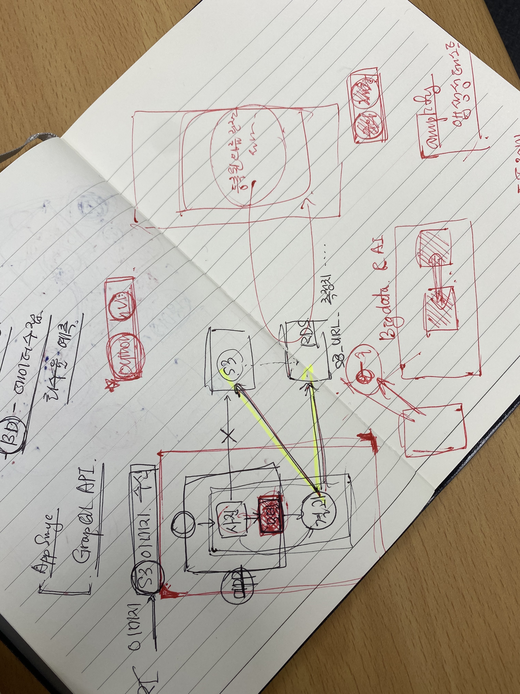

# 클라우드 


## 12/1 클라우드

- Amplify 와 android studio 연동하기

  - Amplify 생성
    https://dev.classmethod.jp/articles/amplify_android_tutorial/

  - Amplify+Android+Cognito 인증 추가 

    https://dev.classmethod.jp/articles/amplify-android-cognito-auth/

  - Amplify와 서버리스기반 소셜 로그인 안드로이드 앱 만들기 

    https://xmrrh.github.io/

    

  - **AWS AppSync**: GraphQL을 사용하여 애플리케이션에서 필요로 하는 데이터를 가져올 수 있는 관리형 서비스.

    - 오프라인 상태에서도 로컬로 데이터 엑세스 가능
    - 온라인 상태가 되면 다시 동기화 해주는 기능

  - **Amazon Cognito**: 가입, 로그인, 액세스 제어 기능을 갖춘 인증 관리 서비스

    - 소셜 로그인 연동 가능

---

  

  ### 작업

  - version check!
  - `amplify init` amplify 프로젝트 생성 (git 명령어와 유사함!)
  - Amplify  user 생성 시 정책 부여 ` administorFullaccess` 나머진 defalut!
  - `amplify add auth` 사용자 인증 기능 추가 -> 수정은 `amplify update auth`
  - **AWS AppSync**: GraphQL을 사용하여 애플리케이션에서 필요로 하는 데이터를 가져올 수 있는 관리형 서비스.
- 오프라인 상태에서도 로컬로 데이터 엑세스 가능
    - 온라인 상태가 되면 다시 동기화 해주는 기능
  - **Amazon Cognito**: 가입, 로그인, 액세스 제어 기능을 갖춘 인증 관리 서비스

    - 소셜 로그인 연동 가능

---

  

  ### 작업

  - version check!

  - `amplify init` amplify 프로젝트 생성 (git 명령어와 유사함!)

  - Amplify  user 생성 시 정책 부여 ` administorFullaccess` 나머진 defalut!

  - `amplify add auth` 사용자 인증 기능 추가 -> 수정은 `amplify update auth` 

    - ```shell
      C:\MyApplication>amplify init
      Note: It is recommended to run this command from the root of your app directory
      ? Enter a name for the project MyApplication
      ? Enter a name for the environment dev
      ? Choose your default editor: None
      ? Choose the type of app that you're building android
      Please tell us about your project
      ? Where is your Res directory:  app/src/main/res
      Using default provider  awscloudformation
      
      For more information on AWS Profiles, see:
      https://docs.aws.amazon.com/cli/latest/userguide/cli-configure-profiles.html
      
      ? Do you want to use an AWS profile? Yes
      ? Please choose the profile you want to use profile-closet
      Adding backend environment dev to AWS Amplify Console app: d3nke7xdbbgtv2`
      ```

    - ```shell
      √ Successfully created initial AWS cloud resources for deployments.
      √ Initialized provider successfully.
      Initialized your environment successfully.
      
      Your project has been successfully initialized and connected to the cloud!
      
      Some next steps:
      "amplify status" will show you what you've added already and if it's locally configured or deployed
      "amplify add <category>" will allow you to add features like user login or a backend API
      "amplify push" will build all your local backend resources and provision it in the cloud
      "amplify console" to open the Amplify Console and view your project status
      "amplify publish" will build all your local backend and frontend resources (if you have hosting category added) and provision it in the cloud
      
      Pro tip:
      Try "amplify add api" to create a backend API and then "amplify publish" to deploy everything
      ```

    - ```shell
      C:\MyApplication>amplify add auth
      Using service: Cognito, provided by: awscloudformation
      
       The current configured provider is Amazon Cognito.
      
       Do you want to use the default authentication and security configuration? Default configuration
       Warning: you will not be able to edit these selections.
       How do you want users to be able to sign in? Email
       Do you want to configure advanced settings? No, I am done.
      Successfully added auth resource myapplicationb2126229 locally
      
      Some next steps:
      "amplify push" will build all your local backend resources and provision it in the cloud
      "amplify publish" will build all your local backend and frontend resources (if you have hosting category added) and provision it in the cloud
      ```

      

  - `amplify push` -> 수정 작업은 `amplify update auth`

  - AWS 관리 콘솔(AWS console->Services->Cognito->User Pools) 확인 가능

  - 안드로이드 스튜디오에서는 아래와 같이 생성값 확인

  

  

  

  

  

  - AWS AppSync 필요성 검토!


# 12/2


### AWS AppSync

- AppSync 는 AWS 에서 제공하는 Managed GraphQL Service

- AWS에서 인프라 및 서버까지 제공해주고 관리해주는 서비스

  

  - GraphQL 의 스키마 정의
  - Resolver 작성
  - DataSource 및 IAM Role 관리

- 쉽게말해, **서버리스의 형태**로 **GraphQL 백엔드**를 개발할 수 있는 서비스
  -> **백엔드 API를 개발**할 때 **엄청난 속도로 개발이 가능**하다는 장점
  -> Firebase  에 비해 **완전한 GraphQL 서비스**로서 **월등한 자유도와 유연함** 장점

- Lambda가 해당 **기능을 대체할 수 있지만** Lambda 메모리 사이즈, 콜드스타트, DataSource와의 통신 유저 토큰 처리등 **고민**하고 **처리해야할 것들이 많음**

- AppSync를 활용한다면 GraphQL 스키마를 작성하고 스키마의 각각의 필드에 대한 resolvers 를 작성하는 것만으로 GraphQL 엔드포인트 생성 가능

- 가장 편리함 점은 resolver 를 **VTL** 이라는 템플릿 언어로 작성 가능하다는 점

- **VTL**로 작성된 resolver 는  Lambda 로 연결되어 커스텀 가능
  
- 그 외에도 DynamoDB, RDB, ElasticSerch, HTTP endpoint 등의  datasouce에 직접 연결 되기때문에 데이터 핸들링이 매우 간편
  
- 대부분의 경우 Copy and Paste 로 끝나는 경우가 많음 
  -> 편리하지만 디버깅은 어려움!
  
  

- AWS AppSync 의 5가지 메뉴 (Schema, Data Sources, Functions, Queries, Settings)

  - Schema menu

    - GraphQL Schema 작성/ 저장
    - 필드에 연결된 resolver 를 생성/조회/삭제
    - 크게 **SCHEMA** 와 **RESLOVER** 설정을 위함
      
      

    - `Create Resources`버튼을 누르면 schema 에서 사용할 데이터 모델 타입정의 + DynamoDB 생성 + 정의된 데이터 타입에 관련된 기본적인 Query, Mutation, Subscription 등의 정의 + resolver 까지 자동 생성됨!
      
      

  - Scalar Type - ID, String, Int , Float, Double + AppSync에서 제공하는 Scalar 타입
    
  - Resolver - **VTL** 이라는 **자바 기반 템플릿 언어**로 작성됨



- - - Unit Resolver - 한반에 바로 끝내는 resolver, 한개의 데이터 소스와 **연결시켜** **request** 와 **response** 를 처리
  - - Pipeline Resolver - Unit reslovers 로 해결되지 않는 복잡한 로직을 처리
      
    
  - Data Sources - 총 6가지의 종류 (DynamoDB, ElasticSearch, Lambda, RDS, Http e.p)
    
  - Functions - Pipeline resolver 구조에서 중간 부분에 위치
    
  - Query
    - GraphQL Playground 기능 제공
    - Cognito 를 통하여 로그인한 상태에서 쿼리를 날려보거나, 
      로그아웃한 상태에서 쿼리를 날려보는 등의 테스트 지원


## AWS Amplify + Android – GraphQL API 추가

### API 설정

- API  를 사용하는 목적은 **보안**때문!

- `amplify add api`

```shell
C:\MyApplication>amplify add api
? Please select from one of the below mentioned services: GraphQL
? Provide API name: myapplication
? Choose the default authorization type for the API Amazon Cognito User Pool
Use a Cognito user pool configured as a part of this project.
? Do you want to configure advanced settings for the GraphQL API No, I am done.
? Do you have an annotated GraphQL schema? No
? Choose a schema template: Single object with fields (e.g., “Todo” with ID, name, description)

The following types do not have '@auth' enabled. Consider using @auth with @model
         - Todo
Learn more about @auth here: https://docs.amplify.aws/cli/graphql-transformer/directives#auth


GraphQL schema compiled successfully.

Edit your schema at C:\MyApplication\amplify\backend\api\myapplication\schema.graphql or place .graphql files in a directory at C:\MyApplication\amplify\backend\api\myapplication\schema
? Do you want to edit the schema now? Yes
Successfully added resource myapplication locally
```

- ` Choose a schema template:` 3가지 항목
  - Single object with fileds - 여러 개의 필드로 이루어진 객채를 하나의 데이터로 묶어 사용할 때
  - One-tomany relationship - 일대다 관계일 때 (블로그 처럼 하나의 포스트에 여러 개의 댓글 형태)
  - Objects with fine-grained access control - 데이터 소유자가 특정 테이블에 접근하여 특정 액션을 하는지 지정하여 사용할 때
>>>>>>> 4548fdd20ea03bf4861c5033fc9ee402dead8ba3

    - ```shell
      C:\MyApplication>amplify init
      Note: It is recommended to run this command from the root of your app directory
      ? Enter a name for the project MyApplication
      ? Enter a name for the environment dev
      ? Choose your default editor: None
      ? Choose the type of app that you're building android
      Please tell us about your project
      ? Where is your Res directory:  app/src/main/res
      Using default provider  awscloudformation
      
      For more information on AWS Profiles, see:
      https://docs.aws.amazon.com/cli/latest/userguide/cli-configure-profiles.html
      
      ? Do you want to use an AWS profile? Yes
      ? Please choose the profile you want to use profile-closet
      Adding backend environment dev to AWS Amplify Console app: d3nke7xdbbgtv2`
      ```
    
    - ```shell
      √ Successfully created initial AWS cloud resources for deployments.
      √ Initialized provider successfully.
      Initialized your environment successfully.
      
      Your project has been successfully initialized and connected to the cloud!
      
      Some next steps:
      "amplify status" will show you what you've added already and if it's locally configured or deployed
      "amplify add <category>" will allow you to add features like user login or a backend API
      "amplify push" will build all your local backend resources and provision it in the cloud
      "amplify console" to open the Amplify Console and view your project status
      "amplify publish" will build all your local backend and frontend resources (if you have hosting category added) and provision it in the cloud
      
      Pro tip:
      Try "amplify add api" to create a backend API and then "amplify publish" to deploy everything
      ```

<<<<<<< HEAD
    - ```shell
      C:\MyApplication>amplify add auth
      Using service: Cognito, provided by: awscloudformation
      
       The current configured provider is Amazon Cognito.
      
       Do you want to use the default authentication and security configuration? Default configuration
       Warning: you will not be able to edit these selections.
       How do you want users to be able to sign in? Email
       Do you want to configure advanced settings? No, I am done.
      Successfully added auth resource myapplicationb2126229 locally
      
      Some next steps:
      "amplify push" will build all your local backend resources and provision it in the cloud
      "amplify publish" will build all your local backend and frontend resources (if you have hosting category added) and provision it in the cloud
      ```
=======
>>>>>>> 4548fdd20ea03bf4861c5033fc9ee402dead8ba3

​      

  - `amplify push` -> 수정 작업은 `amplify update auth`

  - AWS 관리 콘솔(AWS console->Services->Cognito->User Pools) 확인 가능

<<<<<<< HEAD
  - 안드로이드 스튜디오에서는 아래와 같이 생성값 확인

  

  

  

  

  

- AWS AppSync 필요성 검토!

### #참고

- AWS 재입문 블로그 – AppSync 편 (한국어)
  https://dev.classmethod.jp/articles/aws-appsync-re-introduction-2019-korean-ver/
- AWS 입문] AWS Amplify + Android – GraphQL API 추가해보기 | Developers.IO
  https://dev.classmethod.jp/articles/amplify-android-graphql-api/


# 12/4

- 기 학습된 모델이 생성되기 전까지 android 앱에서 s3 이미지저장과 조회 기능 구현하기!


## API (Application Programming Interface)

UI 가 사용자와 사용자가 다룰 대상(H/W or S/W)을 연결

API 는 프로그램과 또 다른 프로그램을 연결해주는 다리 역할


### Amplify 객체 저장소 스토리지 s3 활성화

- `amplify add api`




√ Generated GraphQL operations successfully and saved at app\src\main\graphql\com\amazonaws\amplify\generated\graphql
√ All resources are updated in the cloud

GraphQL endpoint: https://lzz5igqgufeklhvkefl5jq6ubm.appsync-api.us-east-1.amazonaws.com/graphql

- `amplify add storage`




#참고 

- AWS Amplify를 이용한 Android 앱 개발 실습 – 1부
  https://aws.amazon.com/ko/blogs/korea/building-an-android-app-with-aws-amplify-part-1/

- AWS Amplify를 이용한 Android 앱 개발 실습 – 2부
  https://aws.amazon.com/ko/blogs/korea/building-an-android-app-with-aws-amplify-part-2/





