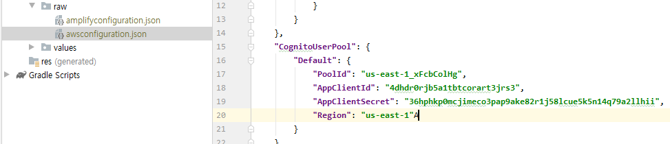

# 클라우드 

## 12/1 클라우드

- Amplify 와 android studio 연동하기

  - Amplify 생성
    https://dev.classmethod.jp/articles/amplify_android_tutorial/

  - Amplify+Android+Cognito 인증 추가 

    https://dev.classmethod.jp/articles/amplify-android-cognito-auth/

  - Amplify와 서버리스기반 소셜 로그인 안드로이드 앱 만들기 

    https://xmrrh.github.io/

    

- **AWS AppSync**: GraphQL을 사용하여 애플리케이션에서 필요로 하는 데이터를 가져올 수 있는 관리형 서비스.

  - 오프라인 상태에서도 로컬로 데이터 엑세스 가능
  - 온라인 상태가 되면 다시 동기화 해주는 기능

- **Amazon Cognito**: 가입, 로그인, 액세스 제어 기능을 갖춘 인증 관리 서비스

  - 소셜 로그인 연동 가능

---

### 작업

- version check!
- `amplify init` amplify 프로젝트 생성 (git 명령어와 유사함!)

- Amplify  user 생성 시 정책 부여 ` administorFullaccess` 나머진 defalut!
- `amplify add auth` 사용자 인증 기능 추가 -> 수정은 `amplify update auth` 
  - 

- `amplify push`하면 -> 수정 작업은 
- AWS 관리 콘솔(AWS console->Services->Cognito->User Pools) 확인 가능
- 안드로이드 스튜디오에서는 아래와 같이 생성값 확인

- AWS AppSync 필요성 검토!