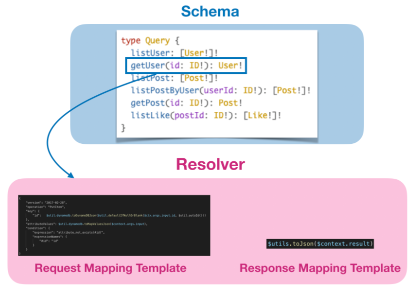

# 12/2


### AWS AppSync

- AppSync 는 AWS 에서 제공하는 Managed GraphQL Service

- AWS에서 인프라 및 서버까지 제공해주고 관리해주는 서비스

  

  - GraphQL 의 스키마 정의
  - Resolver 작성
  - DataSource 및 IAM Role 관리

- 쉽게말해, **서버리스의 형태**로 **GraphQL 백엔드**를 개발할 수 있는 서비스
  -> **백엔드 API를 개발**할 때 **엄청난 속도로 개발이 가능**하다는 장점
  -> Firebase  에 비해 **완전한 GraphQL 서비스**로서 **월등한 자유도와 유연함** 장점

- Lambda가 해당 **기능을 대체할 수 있지만** Lambda 메모리 사이즈, 콜드스타트, DataSource와의 통신 유저 토큰 처리등 **고민**하고 **처리해야할 것들이 많음**

- AppSync를 활용한다면 GraphQL 스키마를 작성하고 스키마의 각각의 필드에 대한 resolvers 를 작성하는 것만으로 GraphQL 엔드포인트 생성 가능

- 가장 편리함 점은 resolver 를 **VTL** 이라는 템플릿 언어로 작성 가능하다는 점

- **VTL**로 작성된 resolver 는  Lambda 로 연결되어 커스텀 가능
  - 그 외에도 DynamoDB, RDB, ElasticSerch, HTTP endpoint 등의  datasouce에 직접 연결 되기때문에 데이터 핸들링이 매우 간편

- 대부분의 경우 Copy and Paste 로 끝나는 경우가 많음 
  -> 편리하지만 디버깅은 어려움!

- AWS AppSync 의 5가지 메뉴 (Schema, Data Sources, Functions, Queries, Settings)

  - Schema menu

    - GraphQL Schema 작성/ 저장
    - 필드에 연결된 resolver 를 생성/조회/삭제
    - 크게 **SCHEMA** 와 **RESLOVER** 설정을 위함
      

    - `Create Resources`버튼을 누르면 schema 에서 사용할 데이터 모델 타입정의 + DynamoDB 생성 + 정의된 데이터 타입에 관련된 기본적인 Query, Mutation, Subscription 등의 정의 + resolver 까지 자동 생성됨!


  - Scalar Type - ID, String, Int , Float, Double + AppSync에서 제공하는 Scalar 타입
    
  - Resolver - **VTL** 이라는 **자바 기반 템플릿 언어**로 작성됨



- - - Unit Resolver - 한반에 바로 끝내는 resolver, 한개의 데이터 소스와 **연결시켜** **request** 와 **response** 를 처리
  - - Pipeline Resolver - Unit reslovers 로 해결되지 않는 복잡한 로직을 처리
      
  - Data Sources - 총 6가지의 종류 (DynamoDB, ElasticSearch, Lambda, RDS, Http e.p)
    
  - Functions - Pipeline resolver 구조에서 중간 부분에 위치
    
  - Query
    - GraphQL Playground 기능 제공
    - Cognito 를 통하여 로그인한 상태에서 쿼리를 날려보거나, 
      로그아웃한 상태에서 쿼리를 날려보는 등의 테스트 지원


## AWS Amplify + Android – GraphQL API 추가

### API 설정

- API  를 사용하는 목적은 **보안**때문!

- `amplify add api`

```shell
C:\MyApplication>amplify add api
? Please select from one of the below mentioned services: GraphQL
? Provide API name: myapplication
? Choose the default authorization type for the API Amazon Cognito User Pool
Use a Cognito user pool configured as a part of this project.
? Do you want to configure advanced settings for the GraphQL API No, I am done.
? Do you have an annotated GraphQL schema? No
? Choose a schema template: Single object with fields (e.g., “Todo” with ID, name, description)

The following types do not have '@auth' enabled. Consider using @auth with @model
         - Todo
Learn more about @auth here: https://docs.amplify.aws/cli/graphql-transformer/directives#auth


GraphQL schema compiled successfully.

Edit your schema at C:\MyApplication\amplify\backend\api\myapplication\schema.graphql or place .graphql files in a directory at C:\MyApplication\amplify\backend\api\myapplication\schema
? Do you want to edit the schema now? Yes
Successfully added resource myapplication locally
```

- ` Choose a schema template:` 3가지 항목
  - Single object with fileds - 여러 개의 필드로 이루어진 객채를 하나의 데이터로 묶어 사용할 때
  - One-tomany relationship - 일대다 관계일 때 (블로그 처럼 하나의 포스트에 여러 개의 댓글 형태)
  - Objects with fine-grained access control - 데이터 소유자가 특정 테이블에 접근하여 특정 액션을 하는지 지정하여 사용할 때


### #참고

- AWS 재입문 블로그 – AppSync 편 (한국어)
  https://dev.classmethod.jp/articles/aws-appsync-re-introduction-2019-korean-ver/

- AWS 입문] AWS Amplify + Android – GraphQL API 추가해보기 | Developers.IO
  https://dev.classmethod.jp/articles/amplify-android-graphql-api/

