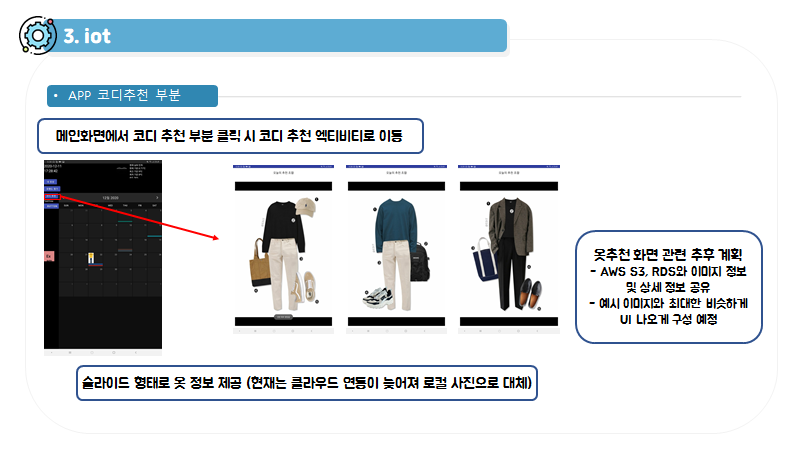

# IoT

### 전체 아키텍처

  

<br>

<br>

# 11/26

**단순 DHT-11 & 라즈베리파이 테스트 예제**

http://blog.naver.com/PostView.nhn?blogId=chandong83&logNo=220902795488

**DHT-11 & 아두이노 & LED - IoT Core와 연동한 예제**

https://kwanulee.github.io/IoTPlatform/start-aws-iot.html

**AWS IoT + Raspberry Pi + Python 예제**

https://blog.iolate.kr/m/246

**amplify - 안드로이드 가이드**

https://aws.amazon.com/ko/getting-started/hands-on/build-android-app-amplify/

<br>

AWS_IoT_Core_Guide.md 파일 작성

<br>

**콘솔 주소**

https://us-west-2.console.aws.amazon.com/console/home?region=us-west-2

<br>

AWS IoT 대화형 자습서 확인

<br>

**AWS IoT에 연결** 

-   디바이스 온보딩 
-   플랫폼 : **Linux/OSX** 선택
-   디바이스 SDK : **Python** 선택

전제 조건 : 디바이스에 **Python 및 Git가 설치**되어 있고 **8883 포트를 통해 퍼블릭 인터넷에 연결(TCP)**되어 있어야 합니다.

<br>

**사물 이름**: TempHumi

사물 유형 및 속성 키·값 설정 X

<br>

**연결키트 다운로드**

  

<br>

디바이스를 구성하고 테스트하려면 다음 단계를 수행해야 합니다.

**1단계**: 디바이스에서 연결 키트의 압축 파일 해제

```
unzip connect_device_package.zip
```

**2단계**: 실행 권한 추가

```
chmod +x start.sh
```

**3단계**: 시작 스크립트 실행. 사물이 보내는 메시지는 아래와 같을 것입니다.

```
./start.sh
디바이스의 메시지 대기
```

<br>

**라즈베리파이 연결**

https://docs.aws.amazon.com/ko_kr/iot/latest/developerguide/connecting-to-existing-device.html

<br>

**AWS IoT MQTT 클라이언트를 사용하여 MQTT 메시지 보기**

https://docs.aws.amazon.com/ko_kr/iot/latest/developerguide/view-mqtt-messages.html

<br>

**강사님께 질문할 것**

DHT-11 과 DHT-22 중 선정 (정밀값)

코디 정보 제공 사진 겹치기에 대한 방법 (z축 이용 덮어쓰기가 가능한지 & How to 플래그먼트?...)

<br>

<br>

# 11/27

**AWS IoT Core MQTT 실행하기**

-   `cd ~/aws-iot-device-sdk-python-v2/samples`

-   `python pubsub.py --topic iot --root-ca ~/certs/AmazonRootCA1.pem --cert ~/certs/63e9aaa7f0-certificate.pem.crt --key ~/certs/63e9aaa7f0-private.pem.key --endpoint avul980x37035-ats.iot.us-west-2.amazonaws.com`

<br>

**나의 엔드포인트**

-   `avul980x37035-ats.iot.us-west-2.amazonaws.com`

<br>

<br>

**온습도 센서 아두이노에서 동작 확인**

**라즈베리파이에서 동작안됨 ㅠㅠ**

-   `cd Adafruit_Python_DHT/examples/`
-   `sudo python AdafruitDHT.py 11 4`

<br>

<br>

# 11/30

UI 구체화

  

<br>

<br>

# 12/01

참고 : https://dev.classmethod.jp/author/jung-haeun/

<br>

#### Amplify + Android 프로젝트 생성 

Amplify CLI 설치

-   `npm install -g @aws-amplify`

IAM 사용자 추가

-   `amplify configure`
-   region : `ap-northeast-2`

username : `taelim`

new_user_credentials.csv 다운로드 받아둠

  

<br>

#### Amazon Cognito 인증

-   `amplify add auth`

  

**상태확인**

-   `amplify status`

프로젝트 갱신

-   `amplify push`

<br>

#### 알게 된 사실

AWS Amplify 연관된 서비스

-   AWS AppSync, Amazon API Gateway
-   Amazon Cognito
-   Amazon Pinpoint, Amazon Kinesis, Amazon Personalize
-   Amazon S3, Amazon CloudFront

<br>

-   **AWS AppSync** : GraphQL을 사용하여 애플리케이션에서 필요로 하는 데이터를 가져올 수 있도록 하는 관리형 서비스. 오프라인 상태이더라도 로컬로 데이터 액세스가 가능하도록 하고, 온라인 상태가 되면 데이터를 다시 동기화해줄 수 있는 기능을 갖추고 있습니다.
-   **Amazon Cognito** : 가입, 로그인, 액세스 제어 기능을 갖춘 인증 관리 서비스. Identity Pool 을 통해 Facebook, Google, Amazon과 같은 소셜 로그인과도 연동이 가능합니다.
-   **Amazon S3** : 데이터를 저장하고 검색할 수 있는 간단한 API를 제공하는 완전 관리형 스토리지 서비스. IAM 정책이나 S3 버킷 정책으로 지정된 대상에게 공유하도록 할 수 있어요.

<br>

<br>

# 12/02

**안드로이드앱**

test 폴더 : 달력에 사진 넣기 테스트 중

https://github.com/kizitonwose/CalendarView 라이브러리 5번 예제를 응용할 예정

**필수 코드**

build.gradle (APP)

```kotlin
implementation "org.jetbrains.kotlin:kotlin-stdlib:$kotlin_version"
implementation 'androidx.core:core-ktx:1.2.0'
implementation 'androidx.appcompat:appcompat:1.1.0'
implementation 'com.google.android.material:material:1.1.0'
implementation 'androidx.constraintlayout:constraintlayout:1.1.3'
implementation 'androidx.legacy:legacy-support-v4:1.0.0'
testImplementation 'junit:junit:4.+'
androidTestImplementation 'androidx.test.ext:junit:1.1.1'
androidTestImplementation 'androidx.test.espresso:espresso-core:3.2.0'
coreLibraryDesugaring 'com.android.tools:desugar_jdk_libs:1.0.9'
implementation 'com.github.kizitonwose:CalendarView:1.0.0'
```

build.gradle (Project)

```kotlin
// Top-level build file where you can add configuration options common to all sub-projects/modules.
buildscript {
    ext.kotlin_version = "1.3.72"
    repositories {
        google()
        jcenter()
    }
    dependencies {
        classpath "com.android.tools.build:gradle:4.1.1"
        classpath "org.jetbrains.kotlin:kotlin-gradle-plugin:$kotlin_version"

        // NOTE: Do not place your application dependencies here; they belong
        // in the individual module build.gradle files
    }
}

allprojects {
    repositories {
        google()
        jcenter()
        maven { url "https://jitpack.io" }
    }
}

task clean(type: Delete) {
    delete rootProject.buildDir
}
```

<br>

<br>

# 12/03

**안드로이드앱**

목적 : 자신의 사진 데이터를 AWS에 저장 후 메인화면 달력 부분에서 저장하게 함

test 폴더 : 달력에 인터넷상의 경로를 통한 사진 올리기 접근 완료

#### **필수 코드**

**build.gradle (APP)**

```kotlin
// Glide 라이브러리
implementation 'com.github.bumptech.glide:glide:4.9.0'
annotationProcessor 'com.github.bumptech.glide:compiler:4.9.0'
implementation "org.jetbrains.anko:anko-commons:0.10.8"
```

**AndroidManifest.xml**

```xml
<uses-permission android:name="android.permission.INTERNET"/>
```

**Fragment.kt**

이미지 불러올 때 형식

```kotlin
val Image1 = container.binding.flightImage1

if (flights[0]?.imageurl != null) {
    Glide.with(view?.context).load(flights[0]?.imageurl).into(Image1)
}
```

data class 재정의 - 이름은 추후 변경 예정 (imageurl 부분 생성 null 허용)

```kotlin
data class Flight(val time: LocalDateTime, val departure: Airport, val destination: Airport, @ColorRes val color: Int, val imageurl: String?) {
    data class Airport(val city: String, val code: String)
}
```

**Utils.kt**

예제 데이터 add, 사진없으면 null로 접근

```kotlin
val currentMonth22 = currentMonth.atDay(22)
    list.add(Flight(currentMonth22.atTime(13, 20), Airport("Ibadan", "IBA"), Airport("Benin", "BNI"), R.color.blue_800,
        "https://github.com/Convergence-Divergence/Trandy-Closet/raw/master/IoT/README.assets/image-20201126095737081.png"
    ))
    list.add(Flight(currentMonth22.atTime(17, 40), Airport("Sokoto", "SKO"), Airport("Ilorin", "ILR"), R.color.red_800, "https://github.com/Convergence-Divergence/Trandy-Closet/raw/master/IoT/README.assets/image-20201126095737081.png"))
```

<br>

<br>

# 12/04

**안드로이드앱**

목적 : 사진 S3에, 정보 RDS에 저장하여 앱에서 접근하고자함.

RDS에 들어갈 필수요소 (날짜, 상의 이미지 경로, 하의 이미지 경로, 그 외 경로)

<br>

**현재시간 출력 필수코드**

```kotlin
<TextClock
                    android:layout_width="wrap_content"
                    android:layout_height="wrap_content"
                    android:format12Hour="yyyy-MM-dd HH:mm:ss"
                    android:textAppearance="@style/TextAppearance.AppCompat.Large" />
```

<br>

**날씨정보 받기**

- openweathermap.org

- API : 메일로 온 Key 참고

- 접근 방법 : `http://api.openweathermap.org/data/2.5/weather?lat=37.476200&lon=126.973154&units=metric&appid=API Key`

- 받은 데이터 형식  

```json
{
    "coord": {
        "lon": 126.97,
        "lat": 37.48
    },
    "weather": [
        {
            "id": 800,
            "main": "Clear",
            "description": "clear sky",
            "icon": "01d"
        }
    ],
    "base": "stations",
    "main": {
        "temp": 4.59,
        "feels_like": -0.64,
        "temp_min": 4,
        "temp_max": 5,
        "pressure": 1028,
        "humidity": 29
    },
    "visibility": 10000,
    "wind": {
        "speed": 2.92,
        "deg": 303
    },
    "clouds": {
        "all": 1
    },
    "dt": 1607065175,
        "sys": {
        "type": 1,
        "id": 8117,
        "country": "KR",
        "sunrise": 1607034654,
        "sunset": 1607069648
    },
    "timezone": 32400,
    "id": 6800035,
    "name": "Banpobondong",
    "cod": 200
}
```


참고

https://m.blog.naver.com/PostView.nhn?blogId=ivory82&logNo=220797022612&proxyReferer=https:%2F%2Fwww.google.com%2F

https://yongyi1587.tistory.com/32

<br>

<br>

# 12/05, 12/06

**멘토링 참고** [보기](https://github.com/Convergence-Divergence/Trandy-Closet/blob/master/meeting/meeting201205.md)

추후 계획 수립

1.  안드로이드 - aws 연동 여부와 관계 없이 일단 앱쪽 진행 예정
    -   첫페이지 로그인 및 연동 관련 액티비티가 생길 수 있으므로 다른 것 부터 진행

2.  메인화면에서 달력부분은 따로 플레그먼트로 구성하여 그 안에서만 달력기능 수행 가능하게 하기
3.  날짜 정보를 시각화 (기존 아이콘 활용 가능성 or 아이콘 아예 찾기)
4.  실제 필요한 시간 단위 수립 (초단위?)
5.  이미지부분 일단 정사각형 4개로 분리한 후 상,하의 쪽만 인터넷상에서 이미지 불러오게 빼놓고 (원피스 같은 경우 생길 수 있으니 조건에 따라 두 이미지 영역을 하나로 뺄수 있게 작업) 나머지 부분은 사용자가 설정하게 하여 조합 (신발/악세 등)
6.  월요일에 정욱이와 옷장 Demo 및 H/W 관련 내용 정리 및 바로 만들기 시작

<br>

<br>

# 12/07

**안드로이드앱 메인 화면 가으자**

1. 일정 부분을 4영역 (왼쪽 위, 왼쪽 아래, 오른 위, 오른쪽 아래로 나누어 영역 할당)  
     

   - 차례대로 iv_cloth_image1, iv_cloth_image2, iv_cloth_image3, iv_cloth_image4 이지만

   - binding 거치는 순간 카멜 형식으로 바뀜

   - ```kotlin
     val Image1 = container.binding.ivClothImage1
     val Image2 = container.binding.ivClothImage2
     val Image3 = container.binding.ivClothImage3
     val Image4 = container.binding.ivClothImage4
     ```

2. 날씨

   - 새로운 예제
     - https://affineur.tistory.com/62
   - 깡샘의 안드로이드 프로그래밍 도전과제 9번 수행
     - https://github.com/kkangseongyun/kkangs_android


한 짓 결과는 실패

<details>
<summary>접기/펼치기 버튼</summary>
<div markdown="1">

### 변경

Example5Fragment.kt

```kotlin
package com.example.test

import android.os.Build
import android.os.Bundle
import android.util.Log
import android.util.TypedValue
import android.view.View
import android.view.ViewGroup
import android.widget.ImageView
import android.widget.TextView
import androidx.annotation.ColorRes
import androidx.annotation.RequiresApi
import androidx.appcompat.widget.Toolbar
import androidx.core.view.children
import androidx.recyclerview.widget.DividerItemDecoration
import androidx.recyclerview.widget.LinearLayoutManager
import androidx.recyclerview.widget.RecyclerView
import com.android.volley.toolbox.Volley
import com.bumptech.glide.Glide
import com.kizitonwose.calendarview.model.CalendarDay
import com.kizitonwose.calendarview.model.CalendarMonth
import com.kizitonwose.calendarview.model.DayOwner
import com.kizitonwose.calendarview.ui.DayBinder
import com.kizitonwose.calendarview.ui.MonthHeaderFooterBinder
import com.kizitonwose.calendarview.ui.ViewContainer
import com.kizitonwose.calendarview.utils.next
import com.kizitonwose.calendarview.utils.previous
import com.example.test.databinding.Example5CalendarDayBinding
import com.example.test.databinding.Example5CalendarHeaderBinding
import com.example.test.databinding.Example5EventItemViewBinding
import com.example.test.databinding.Example5FragmentBinding
import kotlinx.android.synthetic.main.example_5_calendar_day.*
import java.text.SimpleDateFormat
import java.time.LocalDate
import java.time.LocalDateTime
import java.time.YearMonth
import java.time.format.DateTimeFormatter
import java.time.format.TextStyle
import java.util.*

data class Flight(val time: LocalDateTime, val departure: Airport, val destination: Airport, @ColorRes val color: Int, val imageurl: String?) {
    data class Airport(val city: String, val code: String)
}

class Example5FlightsAdapter : RecyclerView.Adapter<Example5FlightsAdapter.Example5FlightsViewHolder>() {

    val flights = mutableListOf<Flight>()

    private val formatter = DateTimeFormatter.ofPattern("EEE'\n'dd MMM'\n'HH:mm")

    override fun onCreateViewHolder(parent: ViewGroup, viewType: Int): Example5FlightsViewHolder {
        return Example5FlightsViewHolder(
            Example5EventItemViewBinding.inflate(parent.context.layoutInflater, parent, false)
        )
    }

    override fun onBindViewHolder(viewHolder: Example5FlightsViewHolder, position: Int) {
        viewHolder.bind(flights[position])
    }

    override fun getItemCount(): Int = flights.size

    inner class Example5FlightsViewHolder(val binding: Example5EventItemViewBinding) :
        RecyclerView.ViewHolder(binding.root) {

        fun bind(flight: Flight) {
            binding.itemFlightDateText.apply {
                text = formatter.format(flight.time)
                setBackgroundColor(itemView.context.getColorCompat(flight.color))
            }

            binding.itemDepartureAirportCodeText.text = flight.departure.code
            binding.itemDepartureAirportCityText.text = flight.departure.city

            binding.itemDestinationAirportCodeText.text = flight.destination.code
            binding.itemDestinationAirportCityText.text = flight.destination.city
        }
    }
}

class Example5Fragment : BaseFragment(R.layout.example_5_fragment), HasToolbar {

    override val toolbar: Toolbar?
        get() = null

    override val titleRes: Int = R.string.example_5_title

    private var selectedDate: LocalDate? = null
    private val monthTitleFormatter = DateTimeFormatter.ofPattern("MMMM")

    private val flightsAdapter = Example5FlightsAdapter()
    private val flights = generateFlights().groupBy { it.time.toLocalDate() }

    private lateinit var binding: Example5FragmentBinding

    override fun onViewCreated(view: View, savedInstanceState: Bundle?) {
        super.onViewCreated(view, savedInstanceState)
        binding = Example5FragmentBinding.bind(view)

        binding.exFiveRv.apply {
            layoutManager = LinearLayoutManager(requireContext(), RecyclerView.VERTICAL, false)
            adapter = flightsAdapter
            addItemDecoration(DividerItemDecoration(requireContext(), RecyclerView.VERTICAL))
        }
        flightsAdapter.notifyDataSetChanged()

        val daysOfWeek = daysOfWeekFromLocale()

        val currentMonth = YearMonth.now()
        binding.exFiveCalendar.setup(currentMonth.minusMonths(10), currentMonth.plusMonths(10), daysOfWeek.first())
        binding.exFiveCalendar.scrollToMonth(currentMonth)

        class DayViewContainer(view: View) : ViewContainer(view) {
            lateinit var day: CalendarDay // Will be set when this container is bound.
            val binding = Example5CalendarDayBinding.bind(view)
            init {
                view.setOnClickListener {
                    if (day.owner == DayOwner.THIS_MONTH) {
                        if (selectedDate != day.date) {
                            val oldDate = selectedDate
                            selectedDate = day.date
                            val binding = this@Example5Fragment.binding
                            binding.exFiveCalendar.notifyDateChanged(day.date)
                            oldDate?.let { binding.exFiveCalendar.notifyDateChanged(it) }
                            updateAdapterForDate(day.date)
                        }
                    }
                }
            }
        }
        binding.exFiveCalendar.dayBinder = object : DayBinder<DayViewContainer> {
            override fun create(view: View) = DayViewContainer(view)
            override fun bind(container: DayViewContainer, day: CalendarDay) {
                container.day = day
                val textView = container.binding.exFiveDayText
                val layout = container.binding.exFiveDayLayout
                textView.text = day.date.dayOfMonth.toString()


                val Image1 = container.binding.ivClothImage1
                val Image2 = container.binding.ivClothImage2
                val Image3 = container.binding.ivClothImage3
                val Image4 = container.binding.ivClothImage4


                val flightTopView = container.binding.exFiveDayFlightTop
                val flightBottomView = container.binding.exFiveDayFlightBottom
                flightTopView.background = null
                flightBottomView.background = null


                if (day.owner == DayOwner.THIS_MONTH) {
                    textView.setTextColorRes(R.color.example_5_text_grey)
                    layout.setBackgroundResource(if (selectedDate == day.date) R.drawable.example_5_selected_bg else 0)

                    val flights = flights[day.date]
                    if (flights != null) {
                        if (flights.count() == 1) {
                            flightBottomView.setBackgroundColor(view.context.getColorCompat(flights[0].color))
                        } else {
                            flightTopView.setBackgroundColor(view.context.getColorCompat(flights[0].color))
                            flightBottomView.setBackgroundColor(view.context.getColorCompat(flights[1].color))
                            if (flights[0]?.imageurl != null) {
//                                Log.d("접근", "${flights[0]?.imageurl}")
//                                Log.d("접근", "${flightImage1}")
//                                Log.d("접근", "${view?.context}")
                                Glide.with(view?.context).load(flights[0]?.imageurl).into(Image1)
                                Glide.with(view?.context).load(flights[1]?.imageurl).into(Image2)
                            }
                        }
                    }
                } else {
                    textView.setTextColorRes(R.color.example_5_text_grey_light)
                    layout.background = null
                }
            }
        }

        class MonthViewContainer(view: View) : ViewContainer(view) {
            val legendLayout = Example5CalendarHeaderBinding.bind(view).legendLayout.root
        }
        binding.exFiveCalendar.monthHeaderBinder = object : MonthHeaderFooterBinder<MonthViewContainer> {
            override fun create(view: View) = MonthViewContainer(view)
            override fun bind(container: MonthViewContainer, month: CalendarMonth) {
                // Setup each header day text if we have not done that already.
                if (container.legendLayout.tag == null) {
                    container.legendLayout.tag = month.yearMonth
//                    container.legendLayout.children.map { it as TextView }.forEachIndexed { index, tv ->
//                        tv.text = daysOfWeek[index].getDisplayName(TextStyle.SHORT, Locale.ENGLISH)
//                            .toUpperCase(Locale.ENGLISH)
//                        tv.setTextColorRes(R.color.example_5_text_grey)
//                        tv.setTextSize(TypedValue.COMPLEX_UNIT_SP, 12f)
//                    }
                    month.yearMonth
                }
            }
        }

        binding.exFiveCalendar.monthScrollListener = { month ->
            val title = "${monthTitleFormatter.format(month.yearMonth)} ${month.yearMonth.year}"
            binding.exFiveMonthYearText.text = title

            selectedDate?.let {
                // Clear selection if we scroll to a new month.
                selectedDate = null
                binding.exFiveCalendar.notifyDateChanged(it)
                updateAdapterForDate(null)
            }
        }

        binding.exFiveNextMonthImage.setOnClickListener {
            binding.exFiveCalendar.findFirstVisibleMonth()?.let {
                binding.exFiveCalendar.smoothScrollToMonth(it.yearMonth.next)
            }
        }

        binding.exFivePreviousMonthImage.setOnClickListener {
            binding.exFiveCalendar.findFirstVisibleMonth()?.let {
                binding.exFiveCalendar.smoothScrollToMonth(it.yearMonth.previous)
            }
        }
    }

    @RequiresApi(Build.VERSION_CODES.LOLLIPOP)
    override fun onStart() {
        super.onStart()
        requireActivity().window.statusBarColor = requireContext().getColorCompat(R.color.example_5_toolbar_color)
    }

    @RequiresApi(Build.VERSION_CODES.LOLLIPOP)
    override fun onStop() {
        super.onStop()
        requireActivity().window.statusBarColor = requireContext().getColorCompat(R.color.colorPrimaryDark)
    }

    private fun updateAdapterForDate(date: LocalDate?) {
        flightsAdapter.flights.clear()
        flightsAdapter.flights.addAll(flights[date].orEmpty())
        flightsAdapter.notifyDataSetChanged()
    }
}

```

<br>

HomeActivity

```kotlin
package com.example.test

import android.graphics.Bitmap
import android.os.Bundle
import android.view.MenuItem
import android.widget.ImageView
import androidx.appcompat.app.AppCompatActivity
import androidx.recyclerview.widget.DividerItemDecoration
import androidx.recyclerview.widget.LinearLayoutManager
import androidx.recyclerview.widget.RecyclerView
import com.android.volley.Request
import com.android.volley.Response
import com.android.volley.toolbox.ImageLoader
import com.android.volley.toolbox.ImageRequest
import com.android.volley.toolbox.StringRequest
import com.android.volley.toolbox.Volley
import com.example.test.databinding.HomeActivityBinding
import kotlinx.android.synthetic.main.example_5_fragment.*
import org.xml.sax.InputSource
import org.w3c.dom.Document
import org.w3c.dom.Element
import java.io.StringReader
import java.text.SimpleDateFormat
import javax.xml.parsers.DocumentBuilderFactory

class HomeActivity : AppCompatActivity() {


    // 날씨 부분 변수 선언
    val symbolView by lazy { mission1_symbol }
    val temperatureView by lazy { mission1_temperature }
    val upView by lazy { mission1_up_text }
    val downView by lazy { mission1_down_text }
    val recyclerView by lazy { mission1_recycler }
    val queue by lazy { Volley.newRequestQueue(this) }

    val list = mutableListOf<WeatherData>()
    val adapter_weather = MyAdapter(list)
    var stringToDate = SimpleDateFormat("yyyy-mm-dd")
    // 날씨 부분 변수 선언 끝

    internal lateinit var binding: HomeActivityBinding

    private val examplesAdapter = HomeOptionsAdapter {
        val fragment = it.createView()
        supportFragmentManager.beginTransaction()
            .run {
                if (fragment is Example5Fragment) {
                    return@run setCustomAnimations(
                        R.anim.slide_in_up,
                        R.anim.fade_out,
                        R.anim.fade_in,
                        R.anim.slide_out_down
                    )
                }
                return@run setCustomAnimations(
                    R.anim.slide_in_right,
                    R.anim.slide_out_left,
                    R.anim.slide_in_left,
                    R.anim.slide_out_right
                )
            }
            .add(R.id.homeContainer, fragment, fragment.javaClass.simpleName)
            .addToBackStack(fragment.javaClass.simpleName)
            .commit()
    }

    override fun onCreate(savedInstanceState: Bundle?) {
        super.onCreate(savedInstanceState)
        binding = HomeActivityBinding.inflate(layoutInflater)
        setContentView(binding.root)
        setSupportActionBar(binding.homeToolbar)
        binding.examplesRv.apply {
            layoutManager = LinearLayoutManager(context, RecyclerView.VERTICAL, false)
            adapter = examplesAdapter
            addItemDecoration(DividerItemDecoration(context, RecyclerView.VERTICAL))
        }

        // 날씨 부분 시작
        recyclerView.let {
            val layoutManager = LinearLayoutManager(this)
//            layoutManager.orientation = LinearLayoutManager.HORIZONTAL
            it.layoutManager = layoutManager
            it.addItemDecoration(MyItemDecoration())
            it.adapter = adapter_weather
        }

        val currentRequest = StringRequest(
            Request.Method.POST,
            "http://api.openweathermap.org/data/2.5/weather?q=seoul&mode=xml&units=metric&appid=4e2d0b710b962dd6098c49dc317096f3",
            Response.Listener { response -> parseXMLCurrent(response) }, Response.ErrorListener {})

        val forecastRequest = StringRequest(Request.Method.POST,
            "https://api.openweathermap.org/data/2.5/forecast?q=seoul&mode=xml&units=metric&appid=4e2d0b710b962dd6098c49dc317096f3",
            Response.Listener { response -> parseXMLForecast(response) }, Response.ErrorListener {})

        queue.add(currentRequest)
        queue.add(forecastRequest)
        // 날씨 부분 끝
    }

    // 날씨 부분 시작
    fun parseXMLCurrent(response: String) {
        try {
            val factory = DocumentBuilderFactory.newInstance()
            val builder = factory.newDocumentBuilder()
            val doc = builder.parse(InputSource(StringReader(response)))
            doc.documentElement.normalize()

            val tempElement = doc.getElementsByTagName("temperature").item(0) as Element
            val temperature = tempElement.getAttribute("value")

            temperatureView.text = temperature
            upView.text = tempElement.getAttribute("max")
            downView.text = tempElement.getAttribute("min")

            val weatherElement = doc.getElementsByTagName("weather").item(0) as Element
            val symbol = weatherElement.getAttribute("icon")

            val imageLoader = ImageLoader(queue, object: ImageLoader.ImageCache {
                override fun getBitmap(url: String?): Bitmap? {
                    return null
                }

                public override fun putBitmap(url: String?, bitmap: Bitmap?) {
                }
            })

            val uriString = "http://openweathermap.org/img/w/$symbol.png"
            symbolView.setImageUrl(uriString, imageLoader)
        } catch (e: Exception) {
            e.printStackTrace()
        }
    }

    fun parseXMLForecast(response: String) {
        try {
            val factory = DocumentBuilderFactory.newInstance()
            val builder = factory.newDocumentBuilder()
            val doc: Document = builder.parse(InputSource(StringReader(response)))
            doc.documentElement.normalize()

            val nodeList = doc.getElementsByTagName("time")

            val minTempList = mutableListOf<Float>()
            val maxTempList = mutableListOf<Float>()

            var newDate: Long? = 0
            var oldDate: Long? = null

            for (i in 0 until nodeList.length) {
                val weatherData = WeatherData("", "", "", null)

                val timeNode = nodeList.item(i) as Element
                val tempNode = timeNode.getElementsByTagName("temperature").item(0) as Element

                weatherData.day = timeNode.getAttribute("from").substring(0..9)
                weatherData.max = tempNode.getAttribute("max")
                weatherData.min = tempNode.getAttribute("min")

                newDate = stringToDate.parse(weatherData.day).time.toLong()

                if (oldDate == null) {
                    oldDate = newDate
                }

                if (newDate == oldDate) {
                    maxTempList.add(weatherData.max.toFloat())
                    minTempList.add(weatherData.min.toFloat())
                }
                else {
                    weatherData.day = weatherData.day.substring(5..9)
                    weatherData.max = maxTempList.max().toString()
                    weatherData.min = minTempList.min().toString()

                    val symbolNode = timeNode.getElementsByTagName("symbol").item(0) as Element
                    val symbol = symbolNode.getAttribute("var")

                    val url = "http://openweathermap.org/img/w/$symbol.png"

                    val imageRequest = ImageRequest(url, Response.Listener {
                        weatherData.img = it
                        adapter_weather.notifyDataSetChanged()
                    }, 0, 0, ImageView.ScaleType.CENTER_CROP, null, Response.ErrorListener {})
                    queue.add(imageRequest)
                    list.add(weatherData)

                    oldDate = newDate

                    maxTempList.clear()
                    minTempList.clear()
                }
            }
        } catch (e: Exception) {
            e.printStackTrace()
        }
    }
    // 날씨 부분 끝

    override fun onOptionsItemSelected(item: MenuItem): Boolean {
        return when (item.itemId) {
            android.R.id.home -> onBackPressed().let { true }
            else -> super.onOptionsItemSelected(item)
        }
    }
}

```

<br>

example_5_fragment.xml

```xml
<?xml version="1.0" encoding="utf-8"?>
<layout xmlns:android="http://schemas.android.com/apk/res/android"
    xmlns:app="http://schemas.android.com/apk/res-auto"
    xmlns:tools="http://schemas.android.com/tools">


    <LinearLayout
        android:layout_width="match_parent"
        android:layout_height="match_parent"
        android:orientation="vertical">

        <LinearLayout
            android:layout_width="200dp"
            android:layout_height="200dp"
            android:orientation="horizontal">

            <LinearLayout
                android:layout_width="match_parent"
                android:layout_height="match_parent"
                android:orientation="vertical">

                <TextClock
                    android:layout_width="200dp"
                    android:layout_height="wrap_content"
                    android:format12Hour="yyyy-MM-dd"
                    android:textAppearance="@style/TextAppearance.AppCompat.Large"
                    android:textColor="@color/white" />

                <TextClock
                    android:layout_width="200dp"
                    android:layout_height="wrap_content"
                    android:format12Hour="HH:mm:ss"
                    android:textAppearance="@style/TextAppearance.AppCompat.Large"
                    android:textColor="@color/white" />
            </LinearLayout>

<!--            날씨 시작-->
            <RelativeLayout
                android:layout_width="200dp"
                android:layout_height="200dp"
                android:background="@drawable/bg">

                <com.android.volley.toolbox.NetworkImageView
                    android:id="@+id/mission1_symbol"
                    android:layout_width="100dp"
                    android:layout_height="100dp"
                    android:layout_marginLeft="40dp"
                    android:layout_marginTop="32dp" />

                <ImageView
                    android:id="@+id/mission1_up_image"
                    android:layout_width="wrap_content"
                    android:layout_height="wrap_content"
                    android:layout_below="@id/mission1_symbol"
                    android:layout_alignLeft="@id/mission1_symbol"
                    android:src="@drawable/ic_up" />

                <TextView
                    android:id="@+id/mission1_up_text"
                    android:layout_width="wrap_content"
                    android:layout_height="wrap_content"
                    android:layout_alignTop="@id/mission1_up_image"
                    android:layout_toRightOf="@id/mission1_up_image"
                    android:textColor="@android:color/white"
                    android:textSize="15dp" />

                <ImageView
                    android:id="@+id/mission1_down_image"
                    android:layout_width="wrap_content"
                    android:layout_height="wrap_content"
                    android:layout_alignTop="@id/mission1_up_image"
                    android:layout_marginLeft="32dp"
                    android:layout_toRightOf="@id/mission1_up_text"
                    android:src="@drawable/ic_down" />

                <TextView
                    android:id="@+id/mission1_down_text"
                    android:layout_width="wrap_content"
                    android:layout_height="wrap_content"
                    android:layout_alignTop="@id/mission1_up_image"
                    android:layout_toRightOf="@id/mission1_down_image"
                    android:textColor="@android:color/white"
                    android:textSize="15dp" />

                <TextView
                    android:id="@+id/mission1_temperature"
                    android:layout_width="wrap_content"
                    android:layout_height="wrap_content"
                    android:layout_below="@id/mission1_up_image"
                    android:layout_marginLeft="24dp"
                    android:textColor="@android:color/white"
                    android:textSize="80dp" />

                <ImageView
                    android:id="@+id/mission1_fahrenheit"
                    android:layout_width="wrap_content"
                    android:layout_height="wrap_content"
                    android:layout_alignTop="@id/mission1_temperature"
                    android:layout_marginLeft="8dp"
                    android:layout_toRightOf="@id/mission1_temperature"
                    android:src="@drawable/ic_fahrenheit" />

                <androidx.recyclerview.widget.RecyclerView
                    android:id="@+id/mission1_recycler"
                    android:layout_width="match_parent"
                    android:layout_height="wrap_content"
                    android:layout_below="@id/mission1_temperature" />

            </RelativeLayout>
            <!--            날씨 끝-->


        </LinearLayout>

        <LinearLayout
            android:layout_width="match_parent"
            android:layout_height="match_parent"
            android:orientation="horizontal">

            <LinearLayout
                android:layout_width="100dp"
                android:layout_height="match_parent"
                android:orientation="vertical"></LinearLayout>

            <LinearLayout android:layout_width="match_parent"
    android:layout_height="match_parent"
    android:background="@color/example_5_page_bg_color"
    android:clickable="true"
    android:focusable="true"
    android:orientation="vertical"
    tools:context=".Example5Fragment">

    <com.google.android.material.appbar.AppBarLayout
        android:id="@+id/exFiveAppBarLayout"
        android:layout_width="match_parent"
        android:layout_height="wrap_content"
        android:background="@color/example_5_toolbar_color"
        android:theme="@style/AppTheme.AppBarOverlay">

        <androidx.constraintlayout.widget.ConstraintLayout
            android:layout_width="match_parent"
            android:layout_height="wrap_content"
            android:orientation="vertical"
            android:padding="14dp">

            <ImageView
                android:id="@+id/exFivePreviousMonthImage"
                android:layout_width="36dp"
                android:layout_height="36dp"
                android:layout_marginEnd="22dp"
                android:background="?attr/selectableItemBackgroundBorderless"
                app:tint="@color/example_5_text_grey"
                app:layout_constraintBottom_toBottomOf="parent"
                app:layout_constraintStart_toStartOf="parent"
                app:layout_constraintTop_toTopOf="parent"
                app:srcCompat="@drawable/ic_chevron_left" />

            <TextView
                android:id="@+id/exFiveMonthYearText"
                android:layout_width="wrap_content"
                android:layout_height="wrap_content"
                android:fontFamily="sans-serif-medium"
                android:textColor="@color/example_5_text_grey"
                android:textSize="22sp"
                app:layout_constraintBottom_toBottomOf="parent"
                app:layout_constraintEnd_toStartOf="@id/exFiveNextMonthImage"
                app:layout_constraintStart_toEndOf="@id/exFivePreviousMonthImage"
                app:layout_constraintTop_toTopOf="parent"
                tools:text="April 2018" />

            <ImageView
                android:id="@+id/exFiveNextMonthImage"
                android:layout_width="36dp"
                android:layout_height="36dp"
                android:background="?attr/selectableItemBackgroundBorderless"
                app:tint="@color/example_5_text_grey"
                app:layout_constraintBottom_toBottomOf="parent"
                app:layout_constraintEnd_toEndOf="parent"
                app:layout_constraintTop_toTopOf="parent"
                app:srcCompat="@drawable/ic_chevron_right" />

        </androidx.constraintlayout.widget.ConstraintLayout>


    </com.google.android.material.appbar.AppBarLayout>

    <LinearLayout
        android:orientation="vertical"
        android:layout_width="match_parent"
        android:layout_height="match_parent">

        <com.kizitonwose.calendarview.CalendarView
            android:id="@+id/exFiveCalendar"
            android:layout_width="match_parent"
            android:layout_height="wrap_content"
            app:cv_dayViewResource="@layout/example_5_calendar_day"
            app:cv_monthHeaderResource="@layout/example_5_calendar_header"
            app:cv_orientation="horizontal"
            app:cv_outDateStyle="endOfGrid"
            app:cv_scrollMode="paged" />

        <androidx.recyclerview.widget.RecyclerView
            android:id="@+id/exFiveRv"
            android:layout_width="match_parent"
            android:layout_height="wrap_content"
            android:nestedScrollingEnabled="false" />
    </LinearLayout>

            </LinearLayout>


        </LinearLayout>

    </LinearLayout>
</layout>
```


<br>

#### 생성

MyAdapter

```kotlin
package com.example.test

import android.view.LayoutInflater
import android.view.ViewGroup
import androidx.recyclerview.widget.RecyclerView

class MyAdapter(val dataList: MutableList<WeatherData>) : RecyclerView.Adapter<MyViewHolder>() {


    override fun getItemCount(): Int = dataList.size
    override fun onCreateViewHolder(parent: ViewGroup, viewType: Int): MyViewHolder {
        return MyViewHolder(LayoutInflater.from(parent?.context).inflate(R.layout.mission1_item, parent, false))
    }

    override fun onBindViewHolder(holder: MyViewHolder, position: Int) {
        val weatherData = dataList[position]

        holder?.let {
            it.dayView.text = weatherData.day
            it.maxView.text = weatherData.max
            it.minView.text = weatherData.min
            it.imgView.setImageBitmap(weatherData.img)
        }
    }
}
```


<br>

MyItemDecoration

```kotlin
package com.example.test

import android.graphics.Rect
import android.view.View
import androidx.recyclerview.widget.RecyclerView

// 각 날씨 리싸이클러 뷰에 데코

class MyItemDecoration : RecyclerView.ItemDecoration() {
    override fun getItemOffsets(
        outRect: Rect,
        view: View,
        parent: RecyclerView,
        state: RecyclerView.State
    ) {
        super.getItemOffsets(outRect, view, parent, state)

        outRect?.set(10, 10, 10, 10)
        view?.setBackgroundColor(-0x776d6f70)
    }
}

// 데코레이션 적용하면 각 날씨에 데코가 생김
```


<br>

MyViewHolder

```kotlin
package com.example.test

// 날씨용 뷰 홀더

import android.graphics.Bitmap
import android.view.View
import android.widget.ImageView
import android.widget.TextView
import androidx.recyclerview.widget.RecyclerView

class MyViewHolder(v: View) : RecyclerView.ViewHolder(v) {
    val dayView = v.findViewById<TextView>(R.id.mission1_item_day)
    val minView = v.findViewById<TextView>(R.id.mission1_item_min)
    val maxView = v.findViewById<TextView>(R.id.mission1_item_max)
    val imgView = v.findViewById<ImageView>(R.id.mission1_item_image)
}


```


<br>

WeatherData

```kotlin
package com.example.test

import android.graphics.Bitmap

data class WeatherData(var max: String, var min: String, var day: String, var img: Bitmap?)
```


<br>

처참히 실패!!!

</div>
</details>

<br>

<br>

# 12/08

**안드로이드앱 메인 화면 가은다.**

  

**수행**

1. 날씨 정보는 불러왔고 달력 부분만 밀기 기능 수행
2. S3 이미지만 가져오면 날짜별로 4칸 이용 이미지 넣기 가능

**할것**

1. 일정 눌렀을 때 해당 부분 확대 기능
2. 시간 어디까지 할지 논의
3. 카메라 연동
4. 날씨부분 아이콘 포함 조금 멋있게
5. 다른쪽 유아이 가자

왜 배경 검정색? 추후 하프 미러 대비

<br>

<br>

# 12/08

**한 것** : 옷 추천 액티비티 제작 (다만 S3 연동이 안되어 일단 로컬 사진으로 대체함)

**만든 class 및 activity, layout**

MyclothActivity.kt

activity_mycloth.xml

fragment_photo.xml

PhotoFragment.kt

PhotoPagerAdapter.kt

PermissionChecker.kt

MediaImage.kt

  

  

슬라이드 형태

<br>

<br>

# 12/09

**한 것** : UI 다듬는 과정 + 옷 수정 기능

  

<br>

<br>

# 12/11

**한 것** : 날씨부분 아이콘 추가 및 정리, AI 모델 안드로이드에서 돌리기, 발표 자료 만들기

**AI 모델 돌리는 예제** (이제야 코드 넣는걸 이해함 하...)

https://codelabs.developers.google.com/codelabs/recognize-flowers-with-tensorflow-on-android/#0

<br>

  

  

  

    

<br>

<br>

# 12/12

**한 것** : S3TransferUtilitySample(업로딩 및 다운로딩) + test(기본 작업 앱)

**주요이슈** : java + kotlin 혼용에 대한 이슈 문제로 kotlin 앱을 기준으로 java 소스 넣기 작업

안되누 안되누... 계속 작업중 가은다 (월요일에 RDS 규칙을 약속 꼭해야할듯)

두 앱간 Gradle 문제가 자주 생긴다.

C:\Users\coolu\.gradle\wrapper\dist 경로의 모든 Gradle 삭제 후 다시 시작

<br>

**S3 APP vs  쪽 기존 작업 APP 파일 정보**

    

<br>

**결론** : git을 통해선 gradle 다운로드 정보가 공유되지 않아 충돌 발생가능, SDK 조절 필수 전반적으로 기능 다 확인 후에 push 해두는게 좋겠다.

<br>

<br>

# 12/13

**한 것** : 

**주요이슈**: 앱 실행시 블루스크린... 원인 모름

  