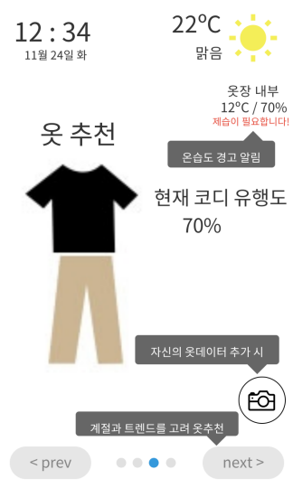
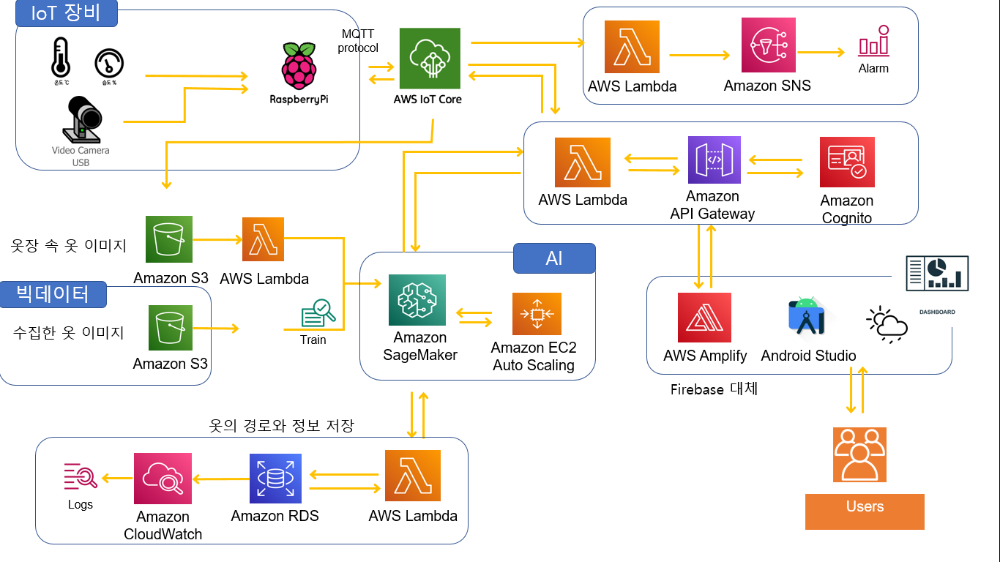

# 회의록 11/25

**주요 이슈** : 기획안 마무리, 아키텍처 마무리, WBS 마무리

**주요 회의 내용** : 각 분야별 WBS 및 아키텍처 강사님께 확인, 기획안 점검

 

**클라우드 박참경 강사님 주요 내용**

AWS 계정의 한계가 있다. & 계정이 이번주는 안나온다.

-   BigData : 자체 DB 이용(S3 X) - maria DB (BigData 공통 AWS)
-   AI : AI 계정 Amazon SageMaker
-   클라우드와 연동된 부분은 활용 가능하다.

 

  

 

### UI 프로토타입

  

 

### 아키텍처

빅데이터 쪽 수정 전

  

 

**아키텍처 초안**

보기

 

**IoT 김구수 강사님 조언**

보기

1.  거리에 문제가 있지 않으면 온습도는 라즈베리파이 하나로 구성하는게 낫다.
2.  라즈베리파이에서 S3 스토리지 쪽으로 넘어가는 방향이 맞다.
3.  옷을 하나하나 찍어서 옷장 속 옷 데이터를 올리는 것이면 지금 구성이 맞다.  
    
4.  **실시간 이미지를 굳이 보여줄 필요가 있을까**
    -   어짜피 내가 있는 옷 중 베스트를 골라주는 것이면 LCD 화면에 입고 있는 옷 중 최상을 알려주는 것이 낫지 않겠냐 그게 아니면 AI보다는 사람이 고른다는 역할이 큰 것 같다. (의미가 떨어진다)
    -   다만 날씨·계절 같은 것을 동시에 고려했으면 좋겠다. 베스트를 골라주면 항상 똑같지 않겠나. 날씨나 다른 변수를 고려해서 순위별 추천은 어떠한가
5.  AR은 어렵다. 다만 내 전신사진이나 아바타를 이용해서 그 위에 찍은 옷(배경 투명)을 겹치는 정도는 어떤가 이것도 쉽지 않은데 너무 딱 떨어지는 사이즈까지 고려하긴 어려울 것 같다.

 

**클라우드 박참경 강사님 조언**

보기

**아키텍처 관련 내용** - 기능적인 언급은 없으셨음

1.  수집을 위한 수집 데이터는 별도로 저장해야 한다.

    -   모델을 만들기위한 데이터 별로도 저장할 것 -> 모델링을 위한 데이터
    -   추천을 위한 데이터 별도 저장  

    -> 논리적으로 구분 가능해야한다.

2.  추천 기능 깔끔하게 (등록 O, 센싱 O, 추천 X, 유행도 판단 X)
3.  아키텍처 상 선을 좀 더 깔끔하게! (헷길리면 안된다.)

 