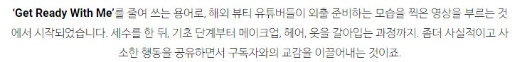
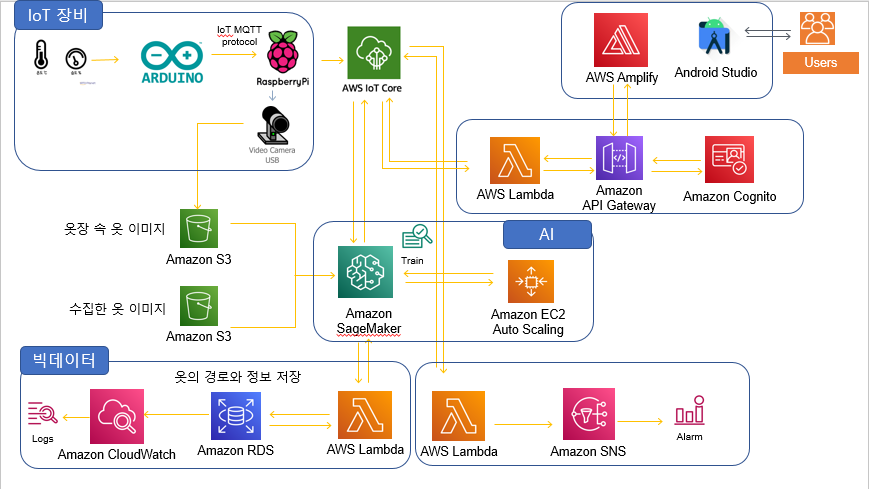
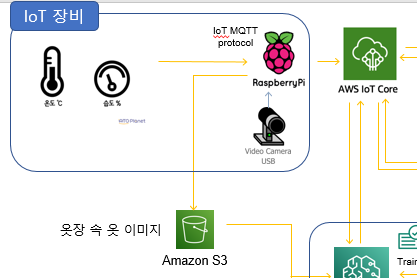

# 회의록 11/25

**주요 이슈** : 기획안 마무리, 아키텍처 마무리

**주요 회의 내용** : 각 분야별 WBS 아키텍처 강사님께 확인, 기획안 점검

 

 

**아키텍처 초안**

**IoT 강사님**

1.  거리에 문제가 있지 않으면 온습도는 라즈베리파이 하나로 구성하는게 낫다.
2.  라즈베리파이에서 S3 스토리지 쪽으로 넘어가는 방향이 맞다.
3.  옷을 하나하나 찍어서 옷장 속 옷 데이터를 올리는 것이면 지금 구성이 맞다.
    
4.  **실시간 이미지를 굳이 보여줄 필요가 있을까**
    -   어짜피 내가 있는 옷 중 베스트를 골라주는 것이면 LCD 화면에 입고 있는 옷 중 최상을 알려주는 것이 낫지 않겠냐 그게 아니면 AI보다는 사람이 고른다는 역할이 큰 것 같다. (의미가 떨어진다)
    -   다만 날씨·계절 같은 것을 동시에 고려했으면 좋겠다. 베스트를 골라주면 항상 똑같지 않겠나. 날씨나 다른 변수를 고려해서 순위별 추천은 어떠한가
5.  AR은 어렵다. 다만 내 전신사진이나 아바타를 이용해서 그 위에 찍은 옷(배경 투명)을 겹치는 정도는 어떤가 이것도 쉽지 않은데 너무 딱 떨어지는 사이즈까지 고려하긴 어려울 것 같다.

