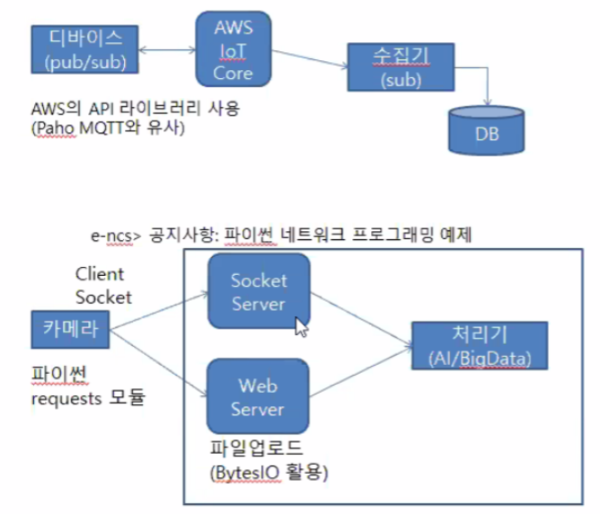
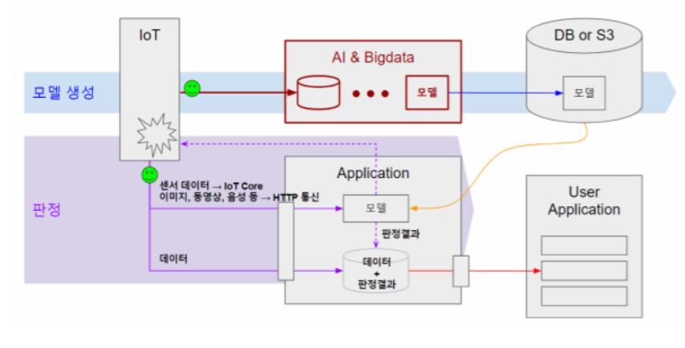

# 회의록 11/27

**주요 이슈** : 각 분야별 역할 진행, Flowchart 그려보기, 설문조사 만들기, dataset 파악

**주요 회의 내용** : 각 분야 강사님 공지내용 공유

 

 

### 금일 진행 내용(아침)

Big - 설문조사 문항 작성 시작, 인스타그램 유저 분석, 올해의 색 예측자료수집

A.I  - fashion dataset 파악, image crop 방식 확인, high dataset 요청

IoT - 구매물품 조사, Raspberry - IoT Core 연동 확인

Cld - 시스템 아키텍처 재정비, flowchat 작성

### 내일 진행 할 내용(저녁)

Big -  옷장에 넣을 옷 크롤링(인스타그램), 인스타그램 유저 분석, 올해의 색 예측자료 수집!

A.I  - 사용 label 선별, fashion dataset 분석

IoT - Raspberry&온습도 센서 연동 확인중 (Arduino&온습도 센서 연동은 확인)

Cld -

 

### AI 강사님 공지내용

sage maker같은 프레임워크를 굳이 사용하지 않아도 된다
중요한 것은 학습시킨 모델을 was에 적용시키는 것
데이터를 어떻게 db에서, iot에서 받아올지는 조마다 상이할 것. 조별로 고민해야할 문제

 

### IoT 강사님 공지내용

-   간단한 데이터 전송시 이용되는 MQTT 통신 사용법
-   대용량 데이터 전송시 이용되는 (파일,동영상) 통신 사용법

AWS IoT core / 라즈베리파이-서버 / 서버 - 안드로이드 통신 방법에 대한 설명

-   우리조 관련 내용

1.  온습도 데이터 서버로 보낼 필요없다면 (AI 혹은 BigData) 바로 안드로이드에서 띄어줘도 되는 것 아니냐
2.  DHT-11 (온습도 센서)가 이미 있는데 성능 좋다고 알려진 DHT-22 구입해야할까요? - 아니요 비슷합니다.
3.  스마트미러 터치 UI 관련은 더 알아볼 것 - 안되면 테블릿 전면카메라 이용하는 것도 생각중이라고 답변

  

### 클라우드강사님 공지내용
위에 파란색 라인은 AI 와 빅데이터반이 수행할 부분
아래 보라샌 라인이 클라우드가 수행할 부분
이라고 전달 받았습니다.
*참고로 보라색에서 나오는 데이터 2개는 동일한 데이터 입니다.
위 내용을 참고해서 서비스 구성도를 약간 수정할 예정입니다.

  

  

 

**to BigData from AI 전신샷이 좋아요, 올해의 색 고려했으면 좋겠어요**

 

### 빅데이터 설문지

패션설문지.docx 문서 참고