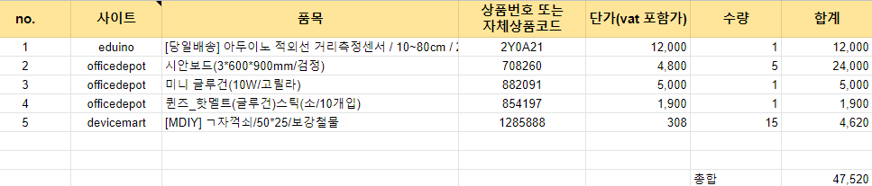

# 회의록 11/30

**주요 이슈** : WBS 정리, 구매물품 신청

**주요 회의 내용** : WBS 선정(smartsheet) 정리 후 회의 진행, 구매물품 신청

 

**금일 진행 내용**

Big -  옷장에 넣을 옷 크롤링(인스타그램), 인스타그램 유저 분석, 올해의 색 예측자료 수집!

A.I  - 사용 label 선별, fashion dataset 분석

IoT - WBS, 구매물품 선별(우드보드, 글루건, 터치필름)

Cld - WBS renewal

 

### 변동사항

-   WBS 프로그램 변경 → smartsheet(30days trial)
    -   https://app.smartsheet.com/sheets/Hwg3QGXVFVvgWvJj8CQWxqqwqWrXfXvGm6Gx3Q31
-   스마트 미러 부분
    -   터치가능스마트미러(기존) → pad 자체 카메라 활용

 

### 오전 회의

1.  **WBS 작성(renewal)** 
    -   협업의 느낌이 나지않는다는 멘토의 전반적인 의견 반영
2.  IoT부분에서 Raspberry Pi의 필요성 재고 
    -   센싱된 온ㆍ습도를 보여주는것만으로도 **의미가 있고 필요**하다 (팀전체의견)
3.  IoT 장비 구매 목록 결정
    -     
4.  UI 설계
    -   IoT에서 기본 틀 생성 후 세부내용 팀원 모두 함께 구상!
5.  빅데이터
    -   설문조사 조사량: 약 **130**회, 후반부 분석할 내용 고민!
    -   더 널리 퍼트리면 좋을 것 같음!
    -   https://forms.gle/s5PtSV33KP7HriTD6
6.  클라우드
    -   도대체 AWS 계정은 언제주는거죠?! (줬다가뺏는건 무슨경우??)

 

### 오후 회의

1.  웬만하면 개발 초기 단계는 아래와 같이 진행하고, 추후 통합
    -   IoT ↔ Cloud
    -   Bigdata ↔ AI
2.  WBS 협업 분야 일정 조율 및 마무리
3.  ☆☆☆ 금주 수요일(12/2) 영남님께서 쾌유의 기념으로 두 턱쏘기로함!!! (대면참석자만 해당)