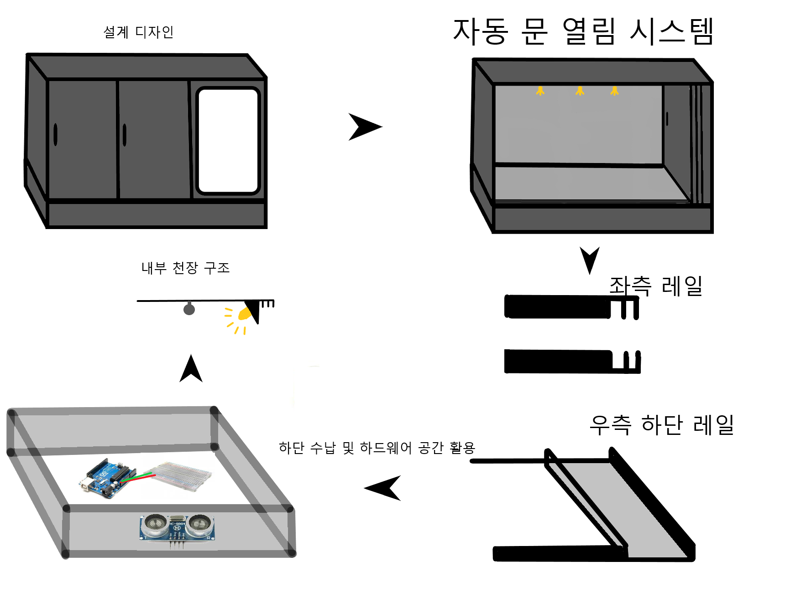

# 회의록 12/02

**주요 이슈** : 현재까지 분야별 진행사항

**주요 회의 내용** :  분야별 하고 있는 내용 정리

 

## 오전 회의

### 진행 사항

**클라우드**

여찬진

- amplify - App 연동 및 데이터 송수신 확인
- Cognito를 활용한 회원가입 및 로그인
- AWS AppSync 추가하기

**AI**

허진녕

- 옷 카테고리 분류 작업 중 : 정확도 70% (실제로는 더 내려갈 듯)
- 색상 분류 폴더를 나눠서 작업중
- 스타일 분류는 잘 안되서 안하는 방향으로

**빅데이터**

심소희

- 무신사 크롤링 코드 작업
- 옷장 내부 예시 데이터 100개 정도 수집 예정
- 동적 크롤링 X : 한 두달 마다 수동 update 방향으로 진행

김영남

- Text 기반 크롤링 작업을 위한 데이터 수집 중
  - 패션 잡지나 사이트 더 알아보기
  - 설문이 130명 정도로 멈춰있음. 더 해보자!
- 팬톤 올해의 색과 관련 사전조사 예정
  - AI의 결과를 참고로 스토리텔링이 가능할 것으로 보임

**IoT**

김태림

- 메인화면 UI 설계 중, 추후 Cloud apmpify - App 연동 예정

최정욱

- 옷장 설계 중  
    
- 크기는 박스정도로 예상

 

### 결과보고서

만들어두는 것에 대한 모두 찬성

- 담당 - 최정욱
- 갱신주기 - 주 단위 (멘토링 보고서 참고 및 망라 느낌)
  

### GitHub

- 각 자 작업내용을 조금씩이라도 github에 업로드 하기!
- 각자의 진척도 파악과 결과보고서 작성 및 포트폴리오 작성에 도움됨!