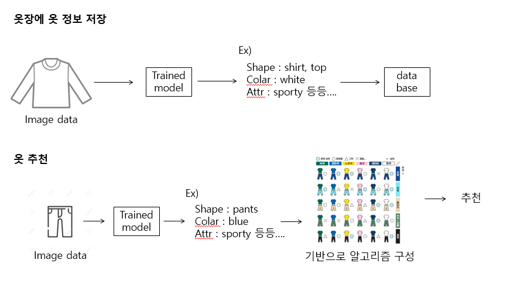

# 회의록 12/03

**주요 이슈** : 기능 정의

**주요 회의 내용** :  기능 정의 및 AI 모델 선정, 데이터셋 정리

 

## 오후 회의

진녕 작성 흐름도

  

 

### 데이터셋(Big + AI)

홍콩대 의류 데이터 베이스 (단일 칼라, 카테고리, 디테일) - 보유 → AI

인스타그램 옷데이터 크롤링 (전신샷) - 진행중 → Big

무신사 쇼핑몰 옷데이터 크롤링 - 진행중 → Big

 

## 기능정의

**총 모델 수 3개**

1.  **보유 옷 저장** - AI 모델 수 2개
    -   이미지 말고 어떤 정보를 같이 저장 (단일 칼라, 카테고리, 디테일, 경로url, 유저정보 , 시즌, 성별) 
        -   진녕스 가능스 (색상, 카테고리, 디테일, 이미지url)
        -   추가되면 좋을 것 (시즌) 
        -   유저 정보로 퉁 (유저정보, 성별)

 

2.  **코디추천**  
    아래 평가기준을 활용해 평가 후 높은 평가치의 의류를 추천해 줌  

    -   코디추천(기존 옷)  
        -   있는 옷들로 색기반 추천 (필수)

    -   코디추천(없는 옷)   
        -   sns 에서 가져오는 이미지 추천 (추가)
        -   가장 유사한 색상 추천 (추가)

 

3.  **유행도 평가(색조합기반)** - AI 모델 수 1개  
    기존 유행도 평가(cnn 알고리즘 유사도 - 사람들이 가장많이 입는 곳 평가치 높음)   
    ~~현재 유행도 평가(색조합기반 - 색상 조합이 알고리즘에 가까울수록 평가치 높음)~~
    -   2개의 평가기준을 합치는건 힘들 것으로 예상
    -   cnn 알고리즘은 어떤 기준으로 유사도를 판단할지 확신 못함

 

4.  온습도 세싱 후 알림 (우선순위 ↓)

 

## 그 외 내용

1.  사진 S3, 정보 RDS - 학습되었다고 생각하고 데이터 형식/타입을 미리 정하자
    -   ex) 추천 우선 순위, 상의 이미지 url, 하의 이미지 url 등의 결과 정보를 앱에서 바로 가져올 수 있게 규칙을 정해두면 좋을 것 같다.
2.  빅데이터
    -   기존 텍스트 크롤링용 사이트가 유료로 전환 (한달 3만원 이상 ㅠㅠ)
    -   크롤링 데이터셋 공유용으로 정리 예정
3.  AI
    -   내일 기능정의 강사님께 멘토링 받기 위해서 정리 작업 중
    -   특히 코디추천을 어떠한 AI모델을 사용할지, 어떠한 방식을 이용할지 알아보고자 함

 

#### 분야별 금일 진행 내용

Big - 무신사 매거진 크롤링, 텍스트 크롤링

A.I  -옷 색상별 분류 모델 테스트

IoT - 메인화면 UI 작업 이어서

Cld - Amplify&Android API 추가, 테스트를 위한 백앤드(S3, RDS) 연동

 