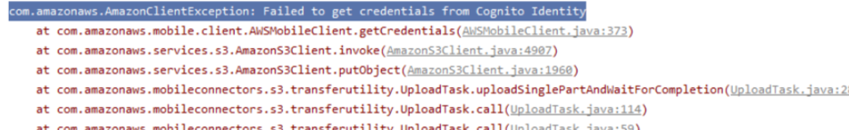

# 회의록 12/05 - 네번째 멘토링

#### 오전 현재까지 진행사항 분야별 발표 / 오후 AI, Cld 멘토님께 개별 멘토링

**주요 이슈** : 오전 멘토링, 오전 회의, 오후 클라우드 멘토링, 오후 회의

**주요 회의 내용** : App에서 AI모델 포함시켜 동작, H/W demo, IoT와 cloud와 연동

 

### 우리 회의 정리 (오전/오후 멘토링 참고)

1.  **App에서 AI모델 포함시켜 동작**

    -   김은기 멘토님 曰
        -   구현 가능, 역할 가능한 사람으로 지정(AI or IoT)
        -   우리가 이해한 내용 2가지 분류 (둘 다 가능)
            1.  python 실행 가능한 곳 → 실행 데이터만 주고 받음
            2.  Android 안 .tflite 파일을 사용하여 앱상에서 모델을 실행

2.  **옷장 Demo 정립**

-   데모의 크기 선정 : 옷의 크기, 종류, 옷장의 크기
    -   우리의 희망 : 실제 옷사이즈 ( 소희 의견 : 일반 우리 옷 몇개만 보여주면 되지 않을까 )
    -   회의 내용 결과 : 옷 저장은 실제 옷으로 보여주되, 옷 추천은 실제 옷 X 따라서 실제 우리 옷을 몇개 정도 넣을 수 있는 사이즈가 필요
-   옷장의 구조와 기능의 필요성 검토
    -   정욱 희망 사항 : 여닫이&모든 문 오픈 → 테블릿이 가려짐(멘토님 지적 사항)
    -   우리가 그렇게 계획을 하려면 모든 문을 오픈하면서 테블릿을 가릴 수 있는지 근거가 뒷받침 되어야한다. 아니면 계획 수정 (월요일에 IoT 만나서 회의 예정)

3.  **계절 정보 누가 어디서?**

-   현재의 계정정보는 프론트(APP)쪽에서 날씨 open API를 활용하여 그 정보를 AI쪽으로 넘겨줄 예정(태림 생각)
-   따라서 클라우드 어느 부분에서 어떠한 형식으로 해당 데이터를 AI쪽에서 참고할 수 있을지 고민해봐야함
-   발표에서는 옷 패턴의 변동이 큰 여름&가을 가정으로 보여주고자함
-   데모를 통해 현재 날씨와 계절정보를 보여주고 설정값으로 진행
    -   APP 쪽에서 현재 시간과 날씨 정보를 받을 수 있어서 AI 쪽과 어떠한 정보를 줄지 약속만하면 태블릿 시간만 바꾸면 계절 정보를 바로 바꿀 수 있을 것 같음

4.  **IoT와 cloud와 연동** (오후 클라우드 멘토 질문을 통해 좋은 정보를 얻음)

-   고민 & 질문

    1.  Amplify 와  Android Studio 연동에서 현재 ref를 참고하면 오류코드가 너무 많다
    2.  버전의 변동이 잦아 변화로 작업의 어려움 느낌 

-   우리의 문제점

    -   오류가 있었을 때 그 오류를 확인하고 남겨놓자!

-   클라우드 멘토분께서 S3 연동이 되는 예제를 알려주심

    -   **S3 예제 깃허브 주소**  

        https://github.com/awslabs/aws-sdk-android-samples/tree/main/S3TransferUtilitySample

    -   그 전엔 우리가 알고 있던 블로그 참고 방안을 물어보셨음  

        https://dev.classmethod.jp/author/jung-haeun/

5.  **(진녕질문) 색분류하기 위한 문제 해결방안**

-   보통 보기 힘든 색을 배경으로 채워서 마스킹 → 나중에 그 색을 제외 ⇒ 색분류 가능성 농후!

 

#### **그 외**

**예정**

토일을 이용하여 노베이스 AWS S3, RDS 데이터 송수신이었음(태림)

**변동**

찬진 - 예제를 통해 AWS S3, 안드로이간 연동 수행

태림 - 안드로이드 앱부분 지속적으로 진행

 

**오후 클라우드 멘토링 이후 찬진 태림 수행 내용 요약**

-   $ `git clone https://dev.classmethod.jp/author/jung-haeun/`
-   res/raw/awsconfiguration.json
    -   PoolId, Bucket 확인 후 다양하게 시도 But 실패

이후 Android 프로젝트 폴더 안에 Amplify 폴더 생성 작업 진행

-   `amplify configure`, `amplify init` 수행
-   Android 프로젝트 폴더 안에 Amplify 폴더 안에 생긴 .json 파일을 옮겨 인증 시도 But 실패
-   주요 오류 내용  
      

 

### 오전 멘토링 상세 내용

 

**김영남 정리 내용**

보기

 
**최종원멘토님**

-   굳이 툴이나 개발로 하지않아도됨 자기만의 시선으로 보는것이 중요함

-   패션사이트같은경우 다른곳도 많으니 잘 찾아서 참고하고 방향성은 좋다고봄

**김학용멘토님**

-   사실 팬톤, 디자이너들이 어쩌고해도 지들맘대로 하는거다
-   제일 영향끼치는건 옷감에 대해서 수요공급에 의해 이루어짐
-   인기많은 온라인쇼핑몰 이용해보는게??

 

**여찬진 정리 내용**

보기

 
### 타조 대표 멘토내용

**AI   조태원 멘토님**

- 발표 흐름을 분야 각각의 설명이 아닌 서비스 흐름으로 발표하겠다

**빅  최종원 멘토님**

	- 비즈니스 플랜 2번 항목 유리병 이미지 및 데이터 팔기 / 오픈 API 만들기 
		-> 좋은 취지, 적극 유도하심

### 7조 멘토내용

**김은기 멘토님**

- tenserflow  lite -> 모델을 임포트해서 예측
- 추가 학습을 위해서는  python 과 작동해야한다.
- 공식 안드로이드 데이터 - 완전한 실시간은 안된다|
  ->시행착오를 겪어가면서 완성도를 높일수 있
  ->시간 문제!!
- 구현 가능하다
  

**최종원 멘토님**

- 전체적인 발표 
- 코딩만에 자기만의 색깔
- AI와 빅데이터  협업 임무 찾을 것!
  

**조태원 멘토님**

- 패션트렌드 색상이랑 옷타입분류
- 색상 위주 기대하고 많이 입는 유사도로 볼것이다
- 캘린더 인상적!
- 캘린더 sns 공유

**김학용 멘토님**

- 패션트렌드 중요한것은 옷감과 색상
- 옷 제조사들이 마진률이 좋은 옷감을 만들어내면 옷을 많이 파니까 그게 유행이 된다
- 비지니스는 돈이다!
  
- 트렌드 정의
- 온라인상에서 공략하는 옷 집중할 것!
- 캘린더 아이디어 신선함!
  
- 인공지능 추천 + 개인 추천 방향 

- HW의 기능이 주요하진 않다
- display 결과물이 중요하다

- H/W 쪽 의문점 다수 - 조명 센서, 초음파 센서\

- 데모를 전제하기 때문에 감안해서 진행할 것!

**유해식 멘토님**

- 12월에 진행 (데모상황시 어떤 계절 옷을 보여줄 것인가?) 
  -> 수집 분석 좋은 데이터인데 
  --> 좋은 결과물이 나올까?
- 사용자별 분류 유저ID  하나에 사용자 추가가능 (확장성)

 - 의미있는 데이터 -사용자별 차별화 된 분석 결과를 도출할 수 있는가?

- 우려사항 - 범위의 제한을 잘 정해서 진행할 것!
- 결과물 기대 됨!

 

**김태림 정리 내용**

보기

 
**김은기 멘토님**

-   안드로이드에서 학습된 모델 사용

    -   파이썬 실행가능한 곳에 넘겨주고 결과값 받기 : 실시간은 보상할 수 없지만 가능

    -   안드로이드 안에서 학습된 모델 변환해서 사용 : 누가 할지를 정해야함 (오후에 질문해봐야할듯)

**조태원 멘토님**

-   발표 자료를 모아서 한명이 발표하면서 팀의 모습이 좋지 않을까
-   캘린더에 사진 넣어두는 것 괜찮은 것 같음

**김학용 멘토님**

-   거리 센서의 위치나 동작 여부를 고민해볼것
-   옷장 문에 태블릿 설치시 문을 열어도 보일 수 있게 하면 좋을 듯
-   앱 요소 보다 하드웨어적인 요소 설계가 부족해보이신것 같음
-   개인의 의견을 피드백 받는 건 좋다. AI의 결과와 나의 피드백을 통한 결과 이렇게 두개 보여주는 방식도 있겠다.

 