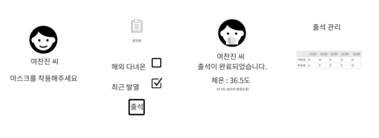

# **주제**

간편하고 스마트한 출결 관리 시스템

 

# **프로젝트 목적**

기존의 **체온 측정** 시스템 + **안면 인식**을 통한 출결, **마스크 착용 유무**를 판단하여 출입 관리

**관리자 입장**

- 사용자들을 확인할 수 있도록 앱/웹 등에서 사용자의 출결, 체온 확인 가능

**사용자 입장**

- 출입 시 키오스크 혹은 테블릿 pc 등을 통해 본인의 출결 체크, 체온 측정,  마스크 착용 확인
- 간단한 문진표 작성
- 마스크 미착용시 마스크 착용에 대한 경고문

 

# 프로젝트 수행 방향

**빅데이터**

- 수강생 데이터 수집

- 데이터분석을 통해 현 주제의 문제 근거 제시

  -qr 코드 인식을 통한 출결체크 및 온도 측정 → 번거로움

  -하원 시 퇴실 체크를 안 하는 수강생의 수가 많음 (→ 카카오톡 등을 통해 퇴실 체크 알람 활성화)

- 출결 관리 시스템 도입 후 사용자들의 의견 및 변수 분석

- 사용되는 데이터 시각화

**AI**

- 얼굴 인식 구분으로 누구인지 확인
- 마스크 착용 유무 판단 - (마스크 미착용 시 경고문 발생)

**IoT**

- 열화상 카메라를 이용한 온도 측정
- (비용적 문제 발생 시) 비접촉 온도 센서(적외선 센서)를 이용한 체온 측정 (코드리스 형태도 가능할 것으로 보임)
- 카메라 - 실시간 이미지 정보 추출 및 데이터화
- 센싱 데이터 무선 통신
- LCD 정보 제공 (키오스크 or 앱)
- 문진체크(터치)
- 실시간 영상
- 마스크 착용 경고문 정보 제공
- 간략한 출석자 정보 제공
- 출격 관리자용 APP
- 날짜별 출결 체크

**클라우드**

- 클라우드 기반의 클라이언트 서비스 배포환경 구축
- AWS 아키텍쳐 설계

 

# 구현 사진 예시

  

 

# 참고자료

1. [FACE RECOGNITION + ATTENDANCE PROJECT | OpenCV Python (2020)]()
2. https://smartstore.naver.com/ins1/products/5190821359?