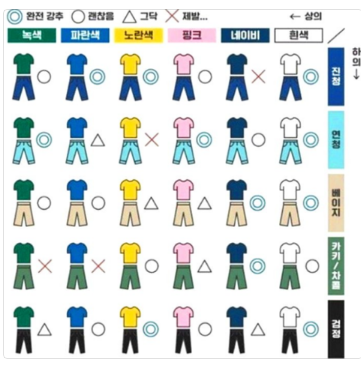

 

- **빅데이터** - 의상 색 조합에 대한 고민 必

  - 매일 코디하기 위해서 들이는 시간과 노력?

  - 자신의 가지고 있는 옷과 어울리는 옷을 추천 받고싶어 함

    → 구글 설문을 통해 데이터 수집 여부

  - 앞으로의 패션 트렌드 예측 (+a) (색기반)

- **AI**

  - 모자, 겉옷, 상의 , 하의 , 신발 ( 5개가 많다하면 3개 종류?)
  - 고른 옷과 어울릴 옷 색기반 분류 - 사물 인식 (옷 정보 저장)
  - 내가 고른 옷과 유사한 다른 온라인쇼핑몰의 상품 추천
  - 지금 의상이 현재 트렌드와 얼마나 유사한지 예측

- **IoT**
  - 옷장 내부 정보 데이터화 -
  - 옷장 자동 제어 → fan, 온습도 ? Fan만으로 온도 습도 제어 가능 여부 → 센서 측정 표시만!
  - 증강현실을 제공하기 위한 실시간 카메라 이미지 정보 추출 및 데이터화 → 추가 기술 확인 필요 (OPEN api)
  - LCD를 통한 코디 정보 제공 → kiosk 정도의 사이즈 필요 ⇒ 지원 유무 파악 필요
  - LCD를 통한 touch UI
  - App 제작

올해의 색이 포함된 조합표 필요함! - 구글링

  

 

 

패션 주제한정적으로 범위를 줄이자

AI 조태원 멘토님

- 색 조합 (상하의 구두 가방) 학습을 통한 추천
- 논문 블라우스, 치마 등 한정적으로 했었다. 그래서 청바지 등 한정적으로 하자

IoT 김학용 멘토님

- 비용문제
- 제습 빼버리는게 낫다 (모듈)
- pc 모니터 추가, 모니터 2개를 통해 코디한 모습을 보여주게 할 수 있으면 어떨까

 

 

# 최종 주제 방향 선정

- **빅데이터**

  - 매일 코디하기 위해서 들이는 시간과 노력?
  - 자신의 가지고 있는 옷과 어울리는 옷을 추천 받고싶어 함 → 구글 설문을 통해 데이터 수집 여부 —→어떤걸 조사해야할까 구매할때 기존에 있는 옷의 조합과 생각을해서 사는지??? 아닌지!!
  - 앞으로의 패션 트렌드 예측 (+a) (색기반)
  - 데이터수집(올해의 색이 포함된 자료)

- **IoT**

  - 옷장 내부 정보 데이터화 → 온습도 측정 및 표시

  - 증강현실을 제공하기 위한 실시간 카메라 이미지 정보 추출 및 데이터화 → 추가 기술 확인 필요 (OPEN api)

  - LCD를 통한 코디 정보 제공 → kiosk 정도의 사이즈 필요 ⇒ 지원 유무 파악 필요

  - LCD를 통한 touch UI

  - App 제작

    →**희망사항**

    - AR 기술 활용 : 실시간 자신의 이미지 + 옷을 입은 이미지 ( 하나의 모니터)

      

    →**현상황**

    - 김학용 멘토님 추천 : 스마트미러 형태의 기능을 하는 아이템 + 다른 모니터를 통해 옷의 추천정보를 알려줌(?)
    - Why? 예산 : LCD(kiosk) → PC 모니터, AR 기술 어려움 → PC 모니터 추가
    - AR 기술을 적용하기 어려울 것이라고 예상 어떠한 방법으로 추천된 옷을 보여줄 수 있을지 고민

    **결론**

    - AR 기술 적용 가능한지 계속 알아보기, 강사멘토님께 여쭤보기
    - 옷장에 스마트 미러 형태로 보여준다면 어떻게 어떠한 정보를 제공해줄 수 있을지

- **AI**

  - 카테고리 분류 → 상의 , 하의 , 신발 [,모자, 겉옷(원피스)] ( 5개가 많다하면 3개 종류?) =⇒ 상의, 하의, 외투, 원피스 (4가지)
  - 고른 옷과 어울릴 옷 색기반 분류 - 사물 인식 (옷 정보 저장) - grad-cam
  - 지금 의상이 현재 트렌드와 얼마나 유사한지 예측
  - 앞으로의 패션 트렌드 색 예측 (+a) (색기반)

- **클라우드**

  - 관리자의 편리한 서비스 관리를 위한 각 기능별 로그 및 모니터링(변경)
  - 사용자에게 온습도가 일정치를 넘었을 경우 SNS 알림 (변경)
  - AWS 를 활용한 클라우드 아키텍쳐 설계  

  python or node.js  

  Amazone Web Serivces  

  - EC2, S3, Lambda&Api Gateway, DynamoDB, SNS, Cloudwatch, Cognito(추가)

→ Iot, 클라우드 반이 협엽해서 사용해야 함 ⇒ 일정부분 학습이 필요함