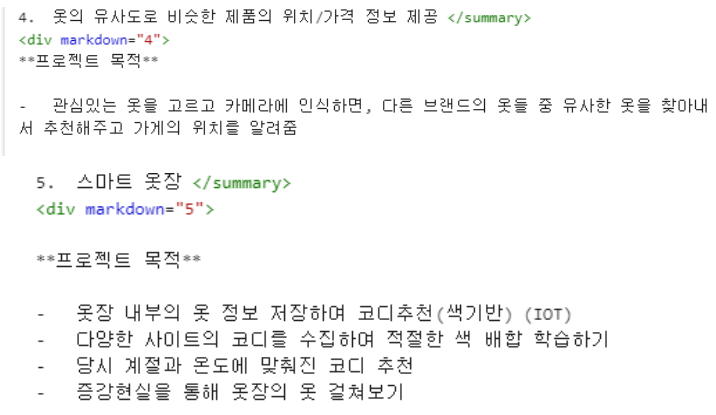
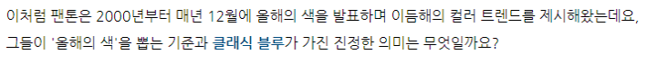
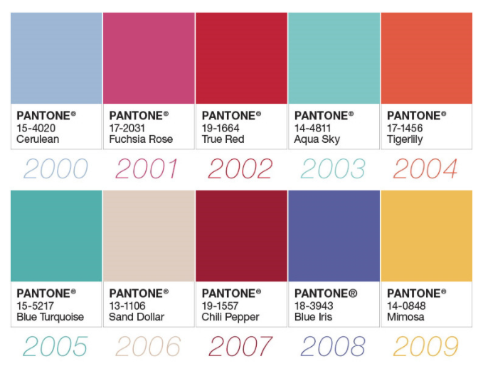
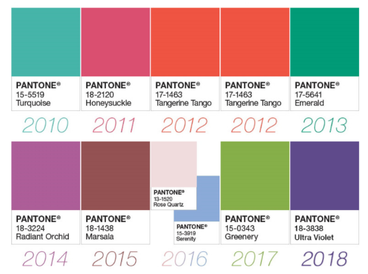
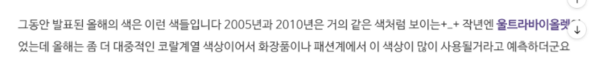
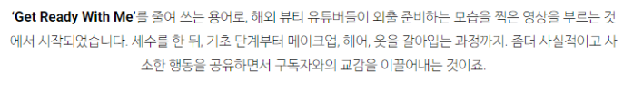

# 프로젝트 주제

- 트랜디한 옷장 → 올해의 색상과 트랜드를 반영한 코디 및 옷 추천 ⇒트렌드 라는 단어가 부각
- 스마트 옷장 → 똑똑한 옷장 ⇒ 무난하고, 정석적인 네임
- Get Ready With Me → 해외 유명 뷰티 유투버가 외출 준비를 하는 영상에서 유래 됐음

 

# 프로젝트 목적

- 옷장 속  보유하고 있는 옷으로 코디 추천
- 옷을 고르는 시간 단축
- 옷을 직접 입어보는 번거로움 해소
- 패션 테러 방지 (자신의 코디 유행도 체크, 부분 적으로 유행하는 옷 추천, 올해의 색 기반)
- 패션 피플 등극 → 자존감 상승
- 자신의 옷장 속 온도와 습도를 실시간으로 확인 → 옷장 속 온도 및 습도 체크
- 다양한 패션 공유??? → 매일 새로운 코디를 동적 크롤링하여 AI에 학습시키며 사용자에게 추천

⇒ 매일 입는 코디에 필요한 시간을 단축시켜주고, 올해의 색상과 현재 트렌드를 반영하여 자신의 옷장 속 코디를 추천해줍니다. 패션에 대한 이해도가 없는 사람도 비교적 쉽게 코디가 가능하고, 패션에 대한 지식이 있는 사람은 현재 트렌드랑 비교하여 개성있는 코디가 가능하게 합니다.

 

# 프로젝트 수행 방향

- 빅데이터

  - 의상 색 조합에 대한 고민 必
  - 매일 코디하기 위해서 들이는 시간과 노력?
  - 자신의 가지고 있는 옷과 어울리는 옷을 추천 받고싶어 함 → 구글 설문을 통해 데이터 수집 여부

- AI

  - 내가 고른 옷과 유사한 다른 온라인쇼핑몰의 상품 추천
  - 고른 옷과 어울릴 옷 색기반 분류
  - 사물 인식 (옷 정보 저장)
  - 지금 의상이 현재 트렌드를 따라가는지 예측
  - 앞으로의 패션 트렌드 예측 (+a)
  - 기술
  - CNN
  - multinomial classification
  - clustering (mean shift, GMM)

- IoT

  - 옷장 내부  정보  데이터화
  - 옷장 자동 제어 → fan, 온습도 ? Fan만으로 온도 습도 제어 가능 여부
  - 증강현실을 제공하기 위한 실시간 카메라 이미지 정보 추출 및 데이터화
  - LCD를 통한 코디 정보 제공 → kiosk 정도의 사이즈 필요 ⇒ 지원 유무 파악 필요
  - LCD 를 통한 touch UI

  -App 제작

- Cloud

  - 클라우드 기반의 클라이언트 서비스 배포환경 구축
  - 기술
  - EC2 : 가상서버
  - S3 : 가상저장소

  -Lamda &API Gateway: serverless backend

  - DynamoDB : NoSql
  - CloudWatch : 로그모니터링, 알림 등
  - RESTful API 개발 연동

  \#클라우드아키텍처 2가지

  1. 각 분야 별 docker 파일로  생성해서 컨테이너화 하는 것
  2. AWS 활용해서 serverless architure 를 구축하는 것

 

# 문제점

- 금액적 문제 → 비교적 큰 LCD 디스플레이 필요
- 유사성 문제 → 기존 상용되고 있는 스타일러와의 유사성 ⇒ 기본적으로 200만원 호가

------

 

 

## **김은기 멘토**

1. 유사 옷 (전 기수 대상)
   - **소스코드** 제공 가능

CNN에서도 어떤 알고리즘을 사용할지 선정

## **조태원 멘토**

4.유사 옷

- 범위를 좀 줄이자
- **현재 입고 잇는 옷의 유행도 평가** (해시태그 조회)

## **유해식 멘토**

1. 유사 옷
   - 온라인 쇼핑몰 상품 추천 알고리즘
2. 스마트 옷잠
   - 11번가 자동 옷 추천 존재
   - **현재 가지고 있는 옷 + 계절 + 없는데 있으면 좋을 옷 추천**!

**클라우드**

- 아키텍처 구현 할 것!

## **김학용 멘토**

1. 유사 옷

   - 데모 보여주기 힘듬

2. 스마트 옷장

   - 온라인 쇼핑몰 옷 크롤링 후 옷 추천

     - > 삼성물산 래미안, LG 에서 비슷한 아이디어 나옴

## **최종원 멘토**

1. 스마트 옷장(추천!)

   - 소셜상에 있는 패션 데이터 수집 -> **패션 트렌드 예측***

     년도 별 유행한 옷의 유형, 재질, 색상 학습 후 추후 트랜드 예측

 

 

## 4번 내용과 5번 내용을 하나로 통합하는 시간이 되겠습니다

1. 일단 두가지 주제를 획일화 해봅시다!

   - 4번 같은 경우는 희망하는 옷 을 카메라로 촬용하여 **다른 매장 상품 검색**(온ㆍ오프라인)
   - 5번 같은 경우는 옷장에서 옷 트랜트 조회 및 자신의 유행도 측정
   - **가상현실  기능**을 사용해서 자신의 몸위에 옷 입혀보기
     - 현재 옷장에 존재하는 옷을 추천하며 **새로운 아이템 추천**까지 코디
     - 소셜상에 있는 패션 데이터 수집 →  **패션 트렌드 예측 (년도별 옷의 스타일, 재질, 색상)** → **현재 입고 있는 옷의 유행도 평가**

   ⇒ **5번의 개념에서 4번의 온라인 쇼핑몰 의류 조희 기능을 덮붙이는 것!**

    

### 주의점 - 굳이 스마트 옷장에 패션 트렌드 예측 기능이 있어야 할지?

※하의는 현재 유행이지만,  상의가 유행에 뒤 떨어진다 ⇒ 현재의 트렌드(스타일 별, 색상 별 등)에 맞는 상의를 추천해준다

https://www.slideshare.net/MinjiKang31/ppt-79412896

미래의 유행을 예측할 수 있을지는 추후 멘토님들과 이야기해봐야

 

올해의 색이 포함된 의상들을 추천, 그 것과 어울릴법한 다른 의상 소품들 추천

 

### #kaggle cloths 데이터셋 (관련 정보 x)

https://www.kaggle.com/siddhrath/fashion-cloths-dataset

- http://mmlab.ie.cuhk.edu.hk/projects/DeepFashion.html

우선 데이터셋은 년도별 →  계절별 →  패션조합 (색, 스타일 등) 수집방법은.... 패션잡지, SNS에서 웹크롤링, 단어 긍정부정 조사 미래에 유행할 색깔이나 패션을 예측할수있을지는? → 올해의 색상

 

 

 

